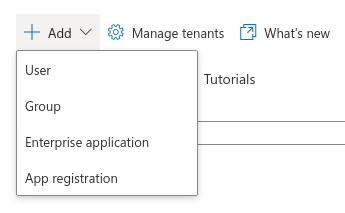
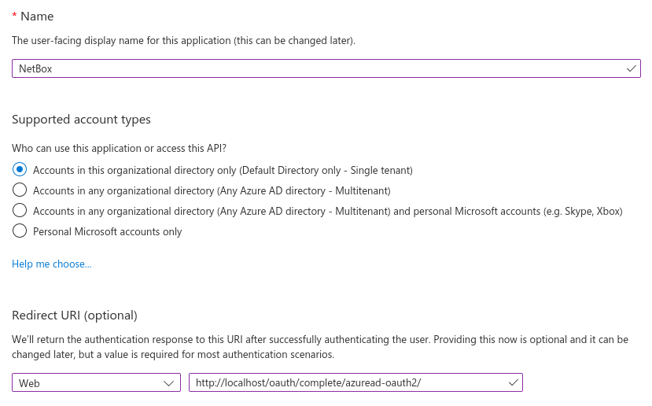
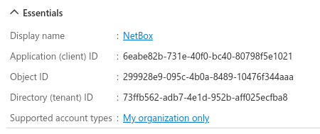
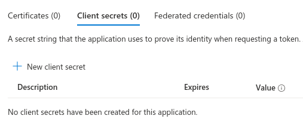
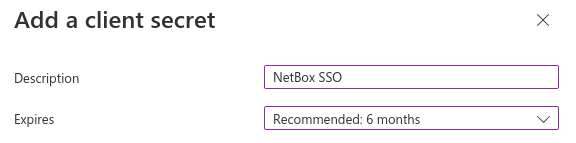
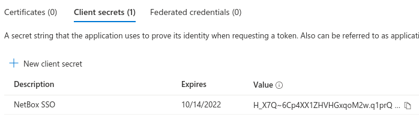
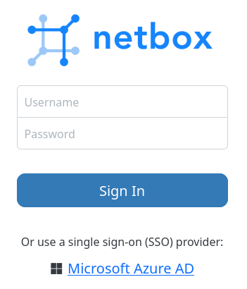
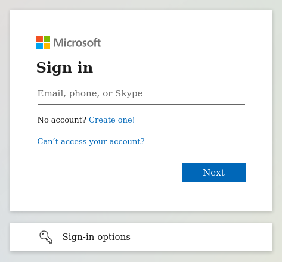

# Microsoft Azure AD

!!! info

    **English (en):** This page was not translated yet!
    **Portuguese (pt-br):** Essa página não foi traduzida ainda!

This guide explains how to configure single sign-on (SSO) support for NetBox using [Microsoft Azure Active Directory (AD)](https://azure.microsoft.com/en-us/services/active-directory/) as an authentication backend.

## Azure AD Configuration

### 1. Create a test user (optional)

Create a new user in AD to be used for testing. You can skip this step if you already have a suitable account created.

### 2. Create an app registration

Under the Azure Active Directory dashboard, navigate to **Add > App registration**.



Enter a name for the registration (e.g. "NetBox") and ensure that the "single tenant" option is selected.

Under "Redirect URI", select "Web" for the platform and enter the path to your NetBox installation, ending with `/oauth/complete/azuread-oauth2/`. Note that this URI **must** begin with `https://` unless you are referencing localhost (for development purposes).



Once finished, make note of the application (client) ID; this will be used when configuring NetBox.



!!! tip "Multitenant authentication"
    NetBox also supports multitenant authentication via Azure AD, however it requires a different backend and an additional configuration parameter. Please see the [`python-social-auth` documentation](https://python-social-auth.readthedocs.io/en/latest/backends/azuread.html#tenant-support) for details concerning multitenant authentication.

### 3. Create a secret

When viewing the newly-created app registration, click the "Add a certificate or secret" link under "Client credentials". Under the "Client secrets" tab, click the "New client secret" button.



You can optionally specify a description and select a lifetime for the secret.



Once finished, make note of the secret value (not the secret ID); this will be used when configuring NetBox.



## NetBox Configuration

### 1. Enter configuration parameters

Enter the following configuration parameters in `configuration.py`, substituting your own values:

```python
REMOTE_AUTH_BACKEND = 'social_core.backends.azuread.AzureADOAuth2'
SOCIAL_AUTH_AZUREAD_OAUTH2_KEY = '{APPLICATION_ID}'
SOCIAL_AUTH_AZUREAD_OAUTH2_SECRET = '{SECRET_VALUE}'
```

### 2. Restart NetBox

Restart the NetBox services so that the new configuration takes effect. This is typically done with the command below:

```no-highlight
sudo systemctl restart netbox
```

## Testing

Log out of NetBox if already authenticated, and click the "Log In" button at top right. You should see the normal login form as well as an option to authenticate using Azure AD. Click that link.



You should be redirected to Microsoft's authentication portal. Enter the username/email and password of your test account to continue. You may also be prompted to grant this application access to your account.



If successful, you will be redirected back to the NetBox UI, and will be logged in as the AD user. You can verify this by navigating to your profile (using the button at top right).

This user account has been replicated locally to NetBox, and can now be assigned groups and permissions within the NetBox admin UI.

## Troubleshooting

### Redirect URI does not Match

Azure requires that the authenticating client request a redirect URI that matches what you've configured for the app in step two. This URI **must** begin with `https://` (unless using `localhost` for the domain).

If Azure complains that the requested URI starts with `http://` (not HTTPS), it's likely that your HTTP server is misconfigured or sitting behind a load balancer, so NetBox is not aware that HTTPS is being use. To force the use of an HTTPS redirect URI, set `SOCIAL_AUTH_REDIRECT_IS_HTTPS = True` in `configuration.py` per the [python-social-auth docs](https://python-social-auth.readthedocs.io/en/latest/configuration/settings.html#processing-redirects-and-urlopen).

### Not Logged in After Authenticating

If you are redirected to the NetBox UI after authenticating successfully, but are _not_ logged in, double-check the configured backend and app registration. The instructions in this guide pertain only to the `azuread.AzureADOAuth2` backend using a single-tenant app registration.