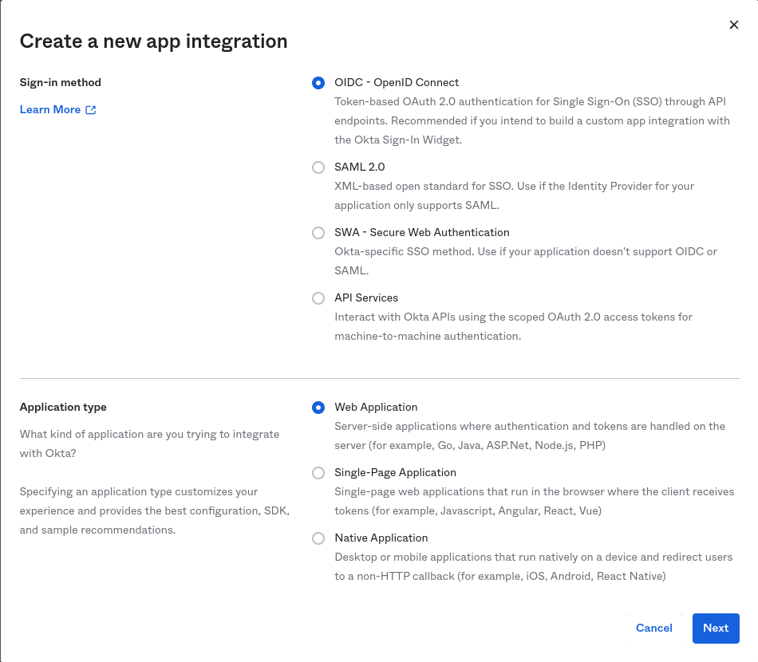
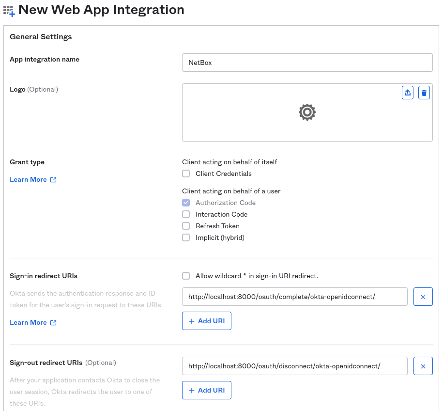
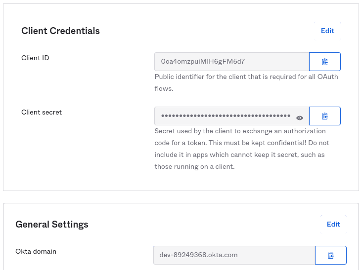
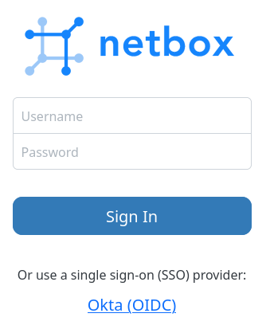
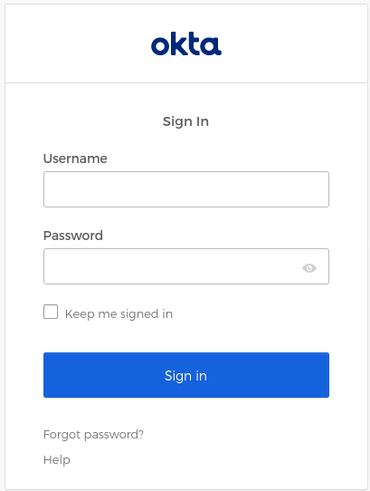

# Okta

!!! info

    **English (en):** This page was not translated yet!
    **Portuguese (pt-br): Essa página não foi traduzida ainda!

This guide explains how to configure single sign-on (SSO) support for NetBox using [Okta](https://www.okta.com/) as an authentication backend.

## Okta Configuration

!!! tip "Okta developer account"
    Okta offers free developer accounts at <https://developer.okta.com/>.

### 1. Create a test user (optional)

Create a new user in the Okta admin portal to be used for testing. You can skip this step if you already have a suitable account created.

### 2. Create an app registration

Within the Okta administration dashboard, navigate to  **Applications > Applications**, and click the "Create App Integration" button. Select "OIDC" as the sign-in method, and "Web application" for the application type.



On the next page, give the app integration a name (e.g. "NetBox") and specify the sign-in and sign-out URIs. These URIs should follow the formats below:

* Sign-in URI: `https://{netbox}/oauth/complete/okta-openidconnect/`
* Sign-out URI: `https://{netbox}/oauth/disconnect/okta-openidconnect/`



Under "Assignments," select the controlled access setting most appropriate for your organization. Click "Save" to complete the creation.

Once finished, note the following parameters. These will be used to configured NetBox.

* Client ID
* Client secret
* Okta domain



## NetBox Configuration

### 1. Enter configuration parameters

Enter the following configuration parameters in `configuration.py`, substituting your own values:

```python
REMOTE_AUTH_BACKEND = 'social_core.backends.okta_openidconnect.OktaOpenIdConnect'
SOCIAL_AUTH_OKTA_OPENIDCONNECT_KEY = '{Client ID}'
SOCIAL_AUTH_OKTA_OPENIDCONNECT_SECRET = '{Client secret}'
SOCIAL_AUTH_OKTA_OPENIDCONNECT_API_URL = 'https://{Okta domain}/oauth2/'
```

### 2. Restart NetBox

Restart the NetBox services so that the new configuration takes effect. This is typically done with the command below:

```no-highlight
sudo systemctl restart netbox
```

## Testing

Log out of NetBox if already authenticated, and click the "Log In" button at top right. You should see the normal login form as well as an option to authenticate using Okta. Click that link.



You should be redirected to Okta's authentication portal. Enter the username/email and password of your test account to continue. You may also be prompted to grant this application access to your account.



If successful, you will be redirected back to the NetBox UI, and will be logged in as the Okta user. You can verify this by navigating to your profile (using the button at top right).

This user account has been replicated locally to NetBox, and can now be assigned groups and permissions within the NetBox admin UI.