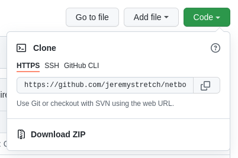

# Começando

!!! info

    **English (en):** This page was not translated yet!
    **Portuguese (pt-br):** Essa página não foi traduzida ainda!

## Setting up a Development Environment

Getting started with NetBox development is pretty straightforward, and should feel very familiar to anyone with Django development experience. There are a few things you'll need:

* A Linux system or compatible environment
* A PostgreSQL server, which can be installed locally [per the documentation](../installation/1-postgresql.md)
* A Redis server, which can also be [installed locally](../installation/2-redis.md)
* Python 3.8 or later

### 1. Fork the Repo

Assuming you'll be working on your own fork, your first step will be to fork the [official git repository](https://github.com/netbox-community/netbox). (If you're a maintainer who's going to be working directly with the official repo, skip this step.) Click the "fork" button at top right (be sure that you've logged into GitHub first).


Copy the URL provided in the dialog box.



You can then clone your GitHub fork locally for development:

```no-highlight hl_lines="1 9"
$ git clone https://github.com/$username/netbox.git
Cloning into 'netbox'...
remote: Enumerating objects: 85949, done.
remote: Counting objects: 100% (4672/4672), done.
remote: Compressing objects: 100% (1224/1224), done.
remote: Total 85949 (delta 3538), reused 4332 (delta 3438), pack-reused 81277
Receiving objects: 100% (85949/85949), 55.16 MiB | 44.90 MiB/s, done.
Resolving deltas: 100% (68008/68008), done.
$ ls netbox/
base_requirements.txt  contrib          docs         mkdocs.yml  NOTICE     requirements.txt  upgrade.sh
CHANGELOG.md           CONTRIBUTING.md  LICENSE.txt  netbox      README.md  scripts
```

### 2. Create a New Branch

The NetBox project utilizes three persistent git branches to track work:

* `master` - Serves as a snapshot of the current stable release
* `develop` - All development on the upcoming stable (patch) release occurs here
* `feature` - Tracks work on an upcoming minor release

Typically, you'll base pull requests off of the `develop` branch, or off of `feature` if you're working on a new major release. For example, assume that the current NetBox release is v3.3.5. Work applied to the `develop` branch will appear in v3.3.6, and work done under the `feature` branch will be included in the next minor release (v3.4.0).

!!! warning
    **Never** merge pull requests into the `master` branch: This branch only ever merges pull requests from the `develop` branch, to effect a new release.

To create a new branch, first ensure that you've checked out the desired base branch, then run:

```no-highlight
git checkout -B $branchname
```

When naming a new git branch, contributors are strongly encouraged to use the relevant issue number followed by a very brief description of the work:

```no-highlight
$issue-$description
```

The description should be just two or three words to imply the focus of the work being performed. For example, bug #1234 to fix a TypeError exception when creating a device might be named `1234-device-typerror`. This ensures that branches are always follow some logical ordering (e.g. when running `git branch -a`) and helps other developers quickly identify the purpose of each.

### 3. Enable Pre-Commit Hooks

NetBox ships with a [git pre-commit hook](https://githooks.com/) script that automatically checks for style compliance and missing database migrations prior to committing changes. This helps avoid erroneous commits that result in CI test failures. You are encouraged to enable it by creating a link to `scripts/git-hooks/pre-commit`:

```no-highlight
cd .git/hooks/
ln -s ../../scripts/git-hooks/pre-commit
```
For the pre-commit hooks to work, you will also need to install the pycodestyle package:

```no-highlight
python -m pip install pycodestyle
```
...and set up the yarn packages as shown in the [Web UI Development Guide](web-ui.md)

### 4. Create a Python Virtual Environment

A [virtual environment](https://docs.python.org/3/tutorial/venv.html) (or "venv" for short) is like a container for a set of Python packages. These allow you to build environments suited to specific projects without interfering with system packages or other projects. When installed per the documentation, NetBox uses a virtual environment in production.

Create a virtual environment using the `venv` Python module:

```no-highlight
mkdir ~/.venv
python3 -m venv ~/.venv/netbox
```

This will create a directory named `.venv/netbox/` in your home directory, which houses a virtual copy of the Python executable and its related libraries and tooling. When running NetBox for development, it will be run using the Python binary at `~/.venv/netbox/bin/python`.

!!! tip "Virtual Environments"
    Keeping virtual environments in `~/.venv/` is a common convention but entirely optional: Virtual environments can be created almost wherever you please. Also consider using [`virtualenvwrapper`](https://virtualenvwrapper.readthedocs.io/en/stable/) to simplify the management of multiple environments.

Once created, activate the virtual environment:

```no-highlight
source ~/.venv/netbox/bin/activate
```

Notice that the console prompt changes to indicate the active environment. This updates the necessary system environment variables to ensure that any Python scripts are run within the virtual environment.

### 5. Install Required Packages

With the virtual environment activated, install the project's required Python packages using the `pip` module. Required packages are defined in `requirements.txt`. Each line in this file specifies the name and specific version of a required package.

```no-highlight
python -m pip install -r requirements.txt
```

### 6. Configure NetBox

Within the `netbox/netbox/` directory, copy `configuration_example.py` to `configuration.py` and update the following parameters:

* `ALLOWED_HOSTS`: This can be set to `['*']` for development purposes
* `DATABASE`: PostgreSQL database connection parameters
* `REDIS`: Redis configuration (if different from the defaults)
* `SECRET_KEY`: Set to a random string (use `generate_secret_key.py` in the parent directory to generate a suitable key)
* `DEBUG`: Set to `True`
* `DEVELOPER`: Set to `True` (this enables the creation of new database migrations)

### 7. Start the Development Server

Django provides a lightweight, auto-updating [HTTP/WSGI server](https://docs.djangoproject.com/en/stable/ref/django-admin/#runserver) for development use. It is started with the `runserver` management command:

```no-highlight hl_lines="1"
$ ./manage.py runserver
Performing system checks...

System check identified no issues (0 silenced).
August 18, 2022 - 15:17:52
Django version 4.0.7, using settings 'netbox.settings'
Starting development server at http://127.0.0.1:8000/
Quit the server with CONTROL-C.
```

This ensures that your development environment is now complete and operational. The development server will monitor the development environment and automatically reload in response to any changes made.

!!! tip "IDE Integration"
    Some IDEs, such as the highly-recommended [PyCharm](https://www.jetbrains.com/pycharm/), will integrate with Django's development server and allow you to run it directly within the IDE. This is strongly encouraged as it makes for a much more convenient development environment.

## UI Development

For UI development you will need to review the [Web UI Development Guide](web-ui.md)

## Populating Demo Data

Once you have your development environment up and running, it might be helpful to populate some "dummy" data to make interacting with the UI and APIs more convenient. Check out the [netbox-demo-data](https://github.com/netbox-community/netbox-demo-data) repo on GitHub, which houses a collection of sample data that can be easily imported to any new NetBox deployment. (This sample data is used to populate the public demo instance at <https://demo.netbox.dev>.)

The demo data is provided in JSON format and loaded into an empty database using Django's `loaddata` management command. Consult the demo data repo's `README` file for complete instructions on populating the data.

## Running Tests

Prior to committing any substantial changes to the code base, be sure to run NetBox's test suite to catch potential errors. Tests are run using the `test` management command, which employs Python's [`unittest`](https://docs.python.org/3/library/unittest.html#module-unittest) library. Remember to ensure that the Python virtual environment is active before running this command. Also keep in mind that these commands are executed in the `netbox/` directory, not the root directory of the repository.

To avoid potential issues with your local configuration file, set the `NETBOX_CONFIGURATION` to point to the packaged test configuration at `netbox/configuration_testing.py`. This will handle things like ensuring that the dummy plugin is enabled for comprehensive testing.

```no-highlight
export NETBOX_CONFIGURATION=netbox.configuration_testing
cd netbox/
python manage.py test
```

In cases where you haven't made any changes to the database schema (which is typical), you can append the `--keepdb` argument to this command to reuse the test database between runs. This cuts down on the time it takes to run the test suite since the database doesn't have to be rebuilt each time. (Note that this argument will cause errors if you've modified any model fields since the previous test run.)

```no-highlight
python manage.py test --keepdb
```

You can also reduce testing time by enabling parallel test execution with the `--parallel` flag. (By default, this will run as many parallel tests as you have processors. To avoid sluggishness, it's a good idea to specify a lower number of parallel tests.) This flag can be combined with `--keepdb`, although if you encounter any strange errors, try running the test suite again with parallelization disabled.

```no-highlight
python manage.py test --parallel <n>
```

Finally, it's possible to limit the run to a specific set of tests, specified by their Python path. For example, to run only IPAM and DCIM view tests:

```no-highlight
python manage.py test dcim.tests.test_views ipam.tests.test_views
```

This is handy for instances where just a few tests are failing and you want to re-run them individually.

!!! info
    NetBox uses [django-rich](https://github.com/adamchainz/django-rich) to enhance Django's default `test` management command.

## Submitting Pull Requests

Once you're happy with your work and have verified that all tests pass, commit your changes and push it upstream to your fork. Always provide descriptive (but not excessively verbose) commit messages. Be sure to prefix your commit message with the word "Fixes" or "Closes" and the relevant issue number (with a hash mark). This tells GitHub to automatically close the referenced issue once the commit has been merged.

```no-highlight
git commit -m "Closes #1234: Add IPv5 support"
git push origin
```

Once your fork has the new commit, submit a [pull request](https://github.com/netbox-community/netbox/compare) to the NetBox repo to propose the changes. Be sure to provide a detailed accounting of the changes being made and the reasons for doing so.

Once submitted, a maintainer will review your pull request and either merge it or request changes. If changes are needed, you can make them via new commits to your fork: The pull request will update automatically.

!!! warning
    Remember, pull requests are permitted only for **accepted** issues. If an issue you want to work on hasn't been approved by a maintainer yet, it's best to avoid risking your time and effort on a change that might not be accepted. (The one exception to this is trivial changes to the documentation or other non-critical resources.)