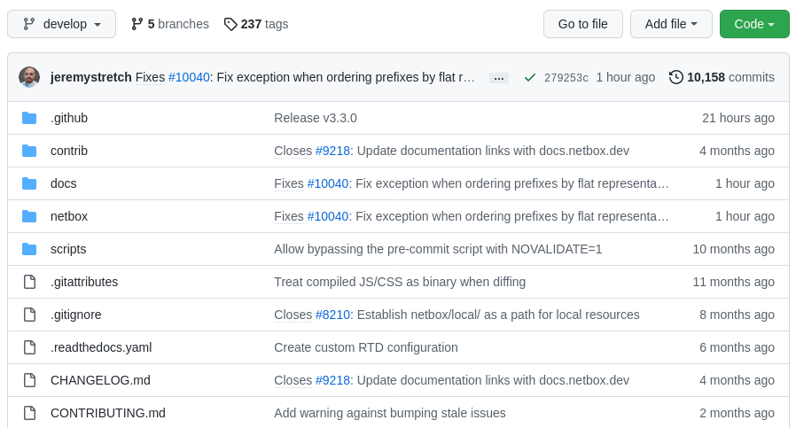
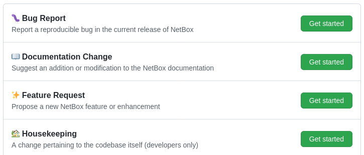

# Desenvolvimento do NetBox

!!! info

    **English (en):** This page was not translated yet!
    **Portuguese (pt-br): Essa página não foi traduzida ainda!

Thanks for your interest in contributing to NetBox! This introduction covers a few important things to know before you get started.

## The Code

NetBox and many of its related projects are maintained on [GitHub](https://github.com/netbox-community/netbox). GitHub also serves as one of our primary discussion forums. While all the code and discussion is publicly accessible, you'll need register for a [free GitHub account](https://github.com/signup) to engage in participation. Most people begin by [forking](https://docs.github.com/en/get-started/quickstart/fork-a-repo) the NetBox repository under their own GitHub account to begin working on the code.

There are three permanent branches in the repository:

* `master` - The current stable release. Individual changes should never be pushed directly to this branch, but rather merged from `develop`.
* `develop` - Active development for the upcoming patch release. Pull requests will typically be based on this branch unless they introduce breaking changes that must be deferred until the next minor release.
* `feature` - New feature work to be introduced in the next minor release (e.g. from v3.3 to v3.4).

NetBox components are arranged into Django apps. Each app holds the models, views, and other resources relevant to a particular function:

* `circuits`: Communications circuits and providers (not to be confused with power circuits)
* `dcim`: Datacenter infrastructure management (sites, racks, and devices)
* `extras`: Additional features not considered part of the core data model
* `ipam`: IP address management (VRFs, prefixes, IP addresses, and VLANs)
* `tenancy`: Tenants (such as customers) to which NetBox objects may be assigned
* `users`: Authentication and user preferences
* `utilities`: Resources which are not user-facing (extendable classes, etc.)
* `virtualization`: Virtual machines and clusters
* `wireless`: Wireless links and LANs

All core functionality is stored within the `netbox/` subdirectory. HTML templates are stored in a common `templates/` directory, with model- and view-specific templates arranged by app. Documentation is kept in the `docs/` root directory.

## Proposing Changes

All substantial changes made to the code base are tracked using [GitHub issues](https://docs.github.com/en/issues). Feature requests, bug reports, and similar proposals must all be filed as issues and approved by a maintainer before work begins. This ensures that all changes to the code base are properly documented for future reference.

To submit a new feature request or bug report for NetBox, select and complete the appropriate [issue template](https://github.com/netbox-community/netbox/issues/new/choose). Once your issue has been approved, you're welcome to submit a [pull request](https://docs.github.com/en/pull-requests) containing your proposed changes.

Check out our [issue intake policy](https://github.com/netbox-community/netbox/wiki/Issue-Intake-Policy) for an overview of the issue triage and approval processes.

!!! tip
    Avoid starting work on a proposal before it has been accepted. Not all proposed changes will be accepted, and we'd hate for you to waste time working on code that might not make it into the project.

## Getting Help

There are two primary forums for getting assistance with NetBox development:

* [GitHub discussions](https://github.com/netbox-community/netbox/discussions) - The preferred forum for general discussion and support issues. Ideal for shaping a feature requests prior to submitting an issue.
* [#netbox on NetDev Community Slack](https://netdev.chat/) - Good for quick chats. Avoid any discussion that might need to be referenced later on, as the chat history is not retained indefinitely.

!!! note
    Don't use GitHub issues to ask for help: These are reserved for proposed code changes only.

## Governance

NetBox follows the [benevolent dictator](http://oss-watch.ac.uk/resources/benevolentdictatorgovernancemodel) model of governance, with [Jeremy Stretch](https://github.com/jeremystretch) ultimately responsible for all changes to the code base. While community contributions are welcomed and encouraged, the lead maintainer's primary role is to ensure the project's long-term maintainability and continued focus on its primary functions.

## Licensing

The entire NetBox project is licensed as open source under the [Apache 2.0 license](https://github.com/netbox-community/netbox/blob/master/LICENSE.txt). This is a very permissive license which allows unlimited redistribution of all code within the project. Note that all submissions to the project are subject to the same license.