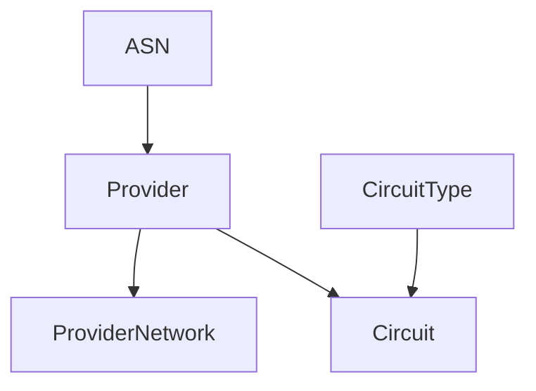

# Circuitos

!!! info

    **English (en):** This page was not translated yet!
    **Portuguese (pt-br):** Essa página não foi traduzida ainda!

NetBox is ideal for managing your network's transit and peering providers and circuits. It provides all the flexibility needed to model physical circuits in both data center and enterprise environments, and allows for "connecting" circuits directly to device interfaces via cables.

## Providers

A provider is any organization which provides Internet or private connectivity. Typically, these are large carriers, however they might also include regional providers or even internal services. Each provider can be assigned account and contact details, and may have one or more AS numbers assigned to it.

Sometimes you'll need to model provider networks into which you don't have full visibility; these are typically represented on topology diagrams with cloud icons. NetBox facilitates this through its provider network model: A provider network represents a "black box" network to which your circuits can connect. A common example is a provider MPLS network connecting multiple sites.

## Circuits

A circuit is a physical connection between two points, which is installed and maintained by an external provider. For example, an Internet connection delivered as a fiber optic cable would be modeled as a circuit in NetBox.

Each circuit is associated with a provider and assigned a circuit ID, which must be unique to that provider. A circuit is also assigned a user-defined type, operational status, and various other operating characteristics.

Each circuit may have up to two terminations (A and Z) defined. Each termination can be associated with a particular site or provider network. In the case of the former, a cable can be connected between the circuit termination and a device component to map its physical connectivity.

!!! warning "Physical vs. Virtual Circuits"
    The circuit model in NetBox represents **physical** connections. Don't confuse these with _virtual_ circuits which may be offered by providers overlaid on physical infrastructure. (For example, a VLAN-tagged subinterface would be a virtual circuit.) A good rule of thumb: If you can't point to it, it's not a physical circuit.