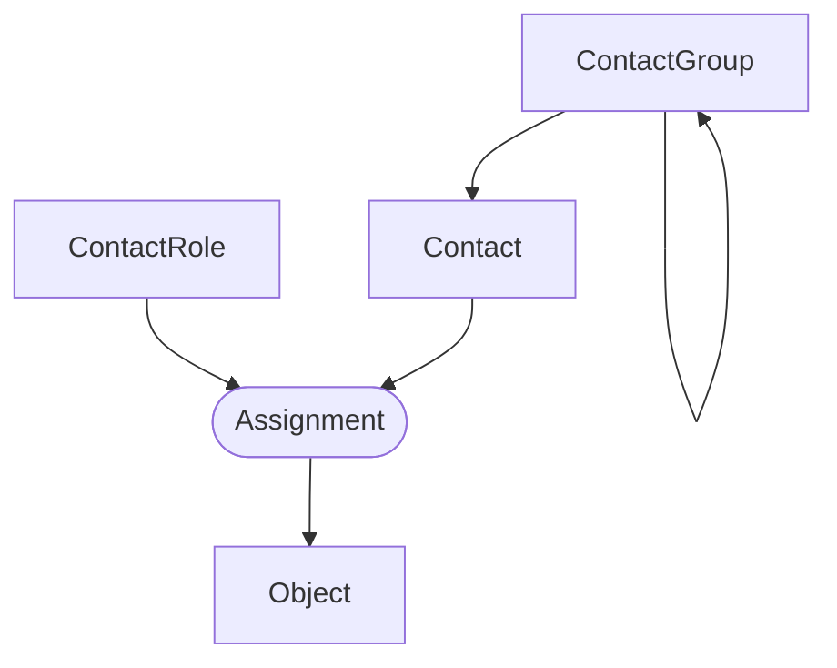

# Contatos

!!! info

    **English (en):** This page was not translated yet!
    **Portuguese (pt-br):** Essa página não foi traduzida ainda!

Much like [tenancy](./tenancy.md), contact assignment enables you to track ownership of resources modeled in NetBox. A contact represents an individual responsible for a resource within the context of its assigned role.

## Contact Groups

Contacts can be grouped arbitrarily into a recursive hierarchy, and a contact can be assigned to a group at any level within the hierarchy.

## Contact Roles

A contact role defines the relationship of a contact to an assigned object. For example, you might define roles for administrative, operational, and emergency contacts.

## Contacts

A contact should represent an individual or permanent point of contact. Each contact must define a name, and may optionally include a title, phone number, email address, and related details.

Contacts are reused for assignments, so each unique contact must be created only once and can be assigned to any number of NetBox objects, and there is no limit to the number of assigned contacts an object may have. Most core objects in NetBox can have contacts assigned to them.

The following models support the assignment of contacts:

* circuits.Circuit
* circuits.Provider
* dcim.Device
* dcim.Location
* dcim.Manufacturer
* dcim.PowerPanel
* dcim.Rack
* dcim.Region
* dcim.Site
* dcim.SiteGroup
* tenancy.Tenant
* virtualization.Cluster
* virtualization.ClusterGroup
* virtualization.VirtualMachine