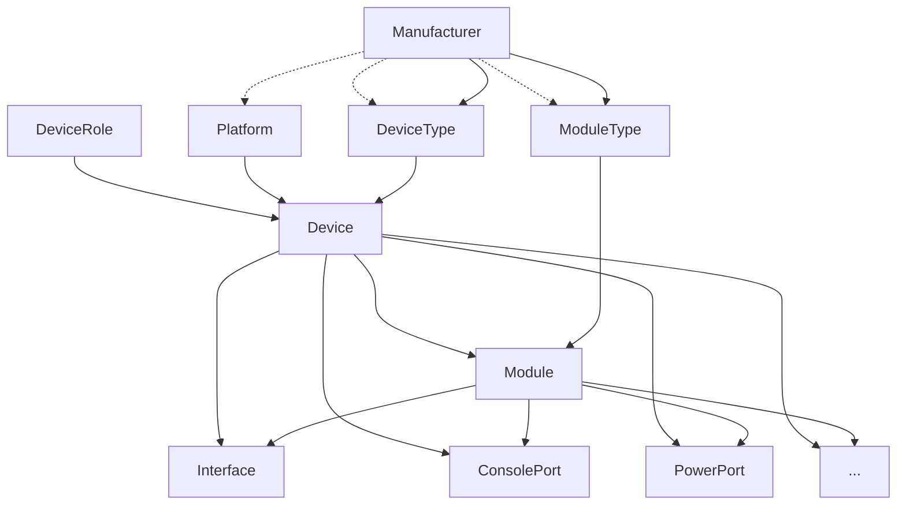
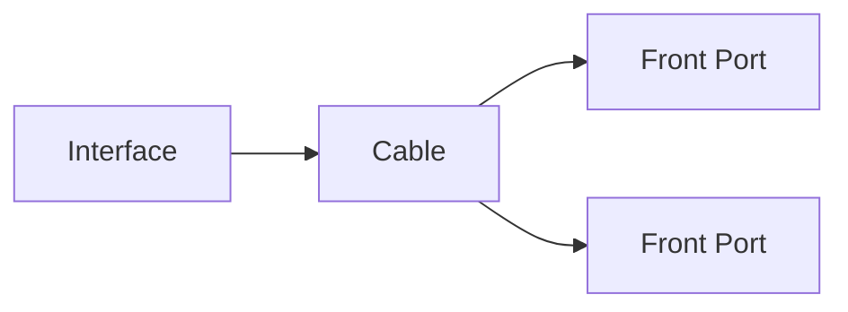

# Cabeamento de Dispositivos

!!! info

    **English (en):** This page was not translated yet!
    **Portuguese (pt-br):** Essa página não foi traduzida ainda!

At its heart, NetBox is a tool for modeling your network infrastructure, and the device object is pivotal to that function. A device can be any piece of physical hardware installed within your network, such as server, router, or switch, and may optionally be mounted within a rack. Within each device, resources such as network interfaces and console ports are modeled as discrete components, which may optionally be grouped into modules.

NetBox uses device types to represent unique real-world device models. This allows a user to define a device type and all its components once, and easily replicate an unlimited number of device instances from it.

## Manufacturers

A manufacturer generally represents an organization which produces hardware devices. These can be defined by users, however they should represent an actual entity rather than some abstract idea.

## Device Types

A device type represents a unique combination of manufacturer and hardware model which maps to discrete make and model of device which exists in the real world. Each device type typically has a number of components created on it, representing network interfaces, device bays, and so on. New devices of this type can then be created in NetBox, and any associated components will be automatically replicated from the device type. This avoids needing to tediously recreate components for each device as it is added in NetBox.

!!! tip "The Device Type Library"
    While users are always free to create their own device types in NetBox, many find it convenient to draw from our [community library](https://github.com/netbox-community/devicetype-library) of pre-defined device types. This is possible because a particular make and model of device is applicable universally and never changes.

All the following can be modeled as components:

* Interfaces
* Console ports
* Console server ports
* Power ports
* Power outlets
* Pass-through ports (front and rear)
* Module bays (which house modules)
* Device bays (which house child devices)

For example, a Juniper EX4300-48T device type might have the following component templates defined:

* One template for a console port ("Console")
* Two templates for power ports ("PSU0" and "PSU1")
* 48 templates for 1GE interfaces ("ge-0/0/0" through "ge-0/0/47")
* Four templates for 10GE interfaces ("xe-0/2/0" through "xe-0/2/3")

Once component templates have been created, every new device that you create as an instance of this type will automatically be assigned each of the components listed above.

!!! note "Component Instantiation is not Retroactive"
    The instantiation of components from a device type definition occurs only at the time of device creation. If you modify the components assigned to a device type, it will not affect devices which have already been created. This guards against any inadvertent changes to existing devices. However, you always have the option of adding, modifying, or deleting components on existing devices. (These changes can easily be applied to multiple devices at once using the bulk operations available in the UI.)

## Devices

Whereas a device type defines the make and model of a device, a device itself represents an actual piece of installed hardware somewhere in the real world. A device can be installed at a particular position within an equipment rack, or simply associated with a site (and optionally with a location within that site).

Each device can have an operational status, functional role, and software platform assigned. Device components are instantiated automatically from the assigned device type upon creation.

### Virtual Chassis

Sometimes it is necessary to model a set of physical devices as sharing a single management plane. Perhaps the most common example of such a scenario is stackable switches. These can be modeled as virtual chassis in NetBox, with one device acting as the chassis master and the rest as members. All components of member devices will appear on the master.

### Virtual Device Contexts

A virtual device context (VDC) is a logical partition within a device. Each VDC operates autonomously but shares a common pool of resources. Each interface can be assigned to one or more VDCs on its device.

## Module Types & Modules

Much like device types and devices, module types can instantiate discrete modules, which are hardware components installed within devices. Modules often have their own child components, which become available to the parent device. For example, when modeling a chassis-based switch with multiple line cards in NetBox, the chassis would be created (from a device type) as a device, and each of its line cards would be instantiated from a module type as a module installed in one of the device's module bays.

!!! tip "Device Bays vs. Module Bays"
    What's the difference between device bays and module bays? Device bays are appropriate when the installed hardware has its own management plane, isolated from the parent device. A common example is a blade server chassis in which the blades share power but operate independently. In contrast, a module bay holds a module which does _not_ operate independently of its parent device, as with the chassis switch line card example mentioned above.

One especially nice feature of modules is that templated components can be automatically renamed according to the module bay into which the parent module is installed. For example, if we create a module type with interfaces named `Gi{module}/0/1-48` and install a module of this type into module bay 7 of a device, NetBox will create interfaces named `Gi7/0/1-48`.

## Cables

NetBox models cables as connections among certain types of device components and other objects. Each cable can be assigned a type, color, length, and label. NetBox will enforce basic sanity checks to prevent invalid connections. (For example, a network interface cannot be connected to a power outlet.)

Either end of a cable may terminate to multiple objects of the same type. For example, a network interface can be connected via a fiber optic cable to two discrete ports on a patch panel (each port attaching to an individual fiber strand in the patch cable).

