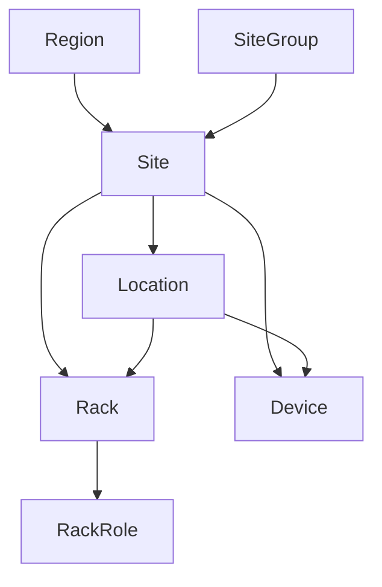

# Facilities (Instalações)

Desde regiões globais até racks de equipamentos individuais, NetBox permite que você modele toda sua presença de rede. Isso é feito através do uso de vários modelos construídos com propósitos específicos. O gráfico abaixo ilustra os modelos e suas relações.

## Regiões (Regions)

Regiões representam domínios geográficos no qual sua rede e seus clientes têm presença. São tipicamente utilizadas para modelar países, estados e cidades, embora o NetBox não prescreva qualquer uso e suas necessidades podem diferir do padrão.

Regiões são aninhadas em si mesmas, então você pode definir regiões filhas que tenham uma região pai, e regiões netas que estão dentro de regiões filhas. Por exemplo, você pode criar uma hierarquia como:
- Europa
    - França
    - Alemanha
    - Espanha
- América do Norte **(parent/pai)**
    - Canadá **(filha/child)**
    - Estados Unidos
        - Califórnia **(neta/grandchildren)**
        - Nova Iorque
        - Texas
- América do Sul
    - Brasil
    - Argentina
    - Paraguai

Regiões sempre serão listados alfabeticamente pelo nome dentro de cada pai, e não há "profundidade" (depth) para a hierarquia.

## Grupos de Site/Locais (Site Groups)

Como as regiões, grupos de sites podem ser arranjados em uma hierarquia recursiva para agrupar sites/locais. No entanto, enquanto que regiões têm a intenção de ser uma organização geográfica, grupos de sites podem ser usados para agrupamentos funcionais. Por exemplo, você pode classificar sites como uma corporação, filial, ou um local do cliente em adição aonde ele está fisicamente localizado.

O uso de ambas regiões e grupos de sites permitem independentes, mas complementares dimensões através do qual sites/locais podem ser organizados.

## Locais (Sites)

Um local tipicamente representa um brédio dentro de uma região e/ou grupo de site (site group). Cada local (site) é atrelado um estado operacional (status) como active (active) ou planejado (planned) e podem ter um endereço de entrega e cordenadas de GPS atribuídas ao local.

## Localização / Lugar (Locations)

Uma localização pode ser qualquer sub-divisão lógica dentro de um prédio, como um andar ou uma sala. Como regiões e grupos de site, localizações podem ser aninhadas em hierarquias aninhadas com flexibilidade máxima. E como sites, cada localização tem um estado operacional (status) atrelados a isso.

## Racks

Finalmente, o NetBox modela cada equipamento de rack como um objeto dentro de um site ou localização. Esses são objetos físicos nos quais os dispositivos são instalados. Cada rack pode ser atribuído a um estado operacional, tipo, ID de instalação e outros atributos relacionados ao rastreamento de invetário. Cada rack também deve definir uma alta (em unidades de rack - U) e largura e podem, opcionalmente, especificar as dimensões físicas.

Cada rack pode ser associado em um site (local), mas essa associação em uma localização (location) dentro de um site é opcional. Usuários também podem criar papéis customizados aos quais os racks podem ser relacionados. NetBox suporta rastreamento do espaço de um rack com unidades parciais, podendo ser criado um rack de tamanho 2.5.

!!! tip

    Você vai notar que o diagrama acima que um dispositivo pode ser instalado dentro de um site, localização ou rack. Essa abordagem permite uma flexibilidade enorme, como nem todos os sites precisam definir uma localização filha e nem todos os dispositivos estão dentro de um rack.