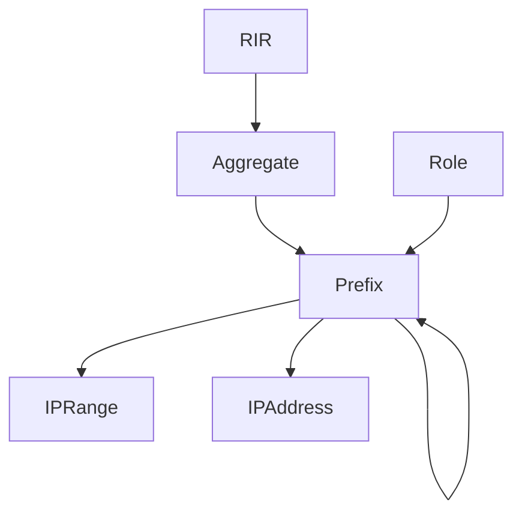

# IPAM (Endereçamento IP)

!!! info

    **English (en):** This page was not translated yet!
    **Portuguese (pt-br):** Essa página não foi traduzida ainda!

IP address management (IPAM) is one of NetBox's core features. It supports full parity for IP4 and IPv6, advanced VRF assignment, automatic hierarchy formation, and much more.

## IP Hierarchy

NetBox employs several object types to represent a hierarchy of IP resources:

* **Aggregate** - A prefix which represents the root of an addressing hierarchy. This is typically a large swath of public or private address space allocated for use by your organization. Each aggregate is assigned to an authoritative RIR.
* **Prefix** - A subnet defined within an aggregate. Prefixes extend the hierarchy by nesting within one another. (For example, 192.168.123.0/24 will appear within 192.168.0.0/16.) Each prefix can be assigned a functional role as well as an operational status.
* **IP Range** - An arbitrary range of individual IP addresses within a prefix, all sharing the same mask. Ranges are commonly affiliated with DHCP scopes, but can be used for any similar purpose.
* **IP Address** - An individual IP address along with its subnet mask, automatically arranged beneath its parent prefix.

!!! tip "Automatic Hierarchies"
    IP objects in NetBox never need to be manually assigned to the parent objects. The construction of hierarchies is handled automatically by the application according to the inherent rules of IP addressing.

An example hierarchy might look like this:

* 100.64.0.0/10 (aggregate)
    * 100.64.0.0/20 (prefix)
    * 100.64.16.0/20 (prefix)
        * 100.64.16.0/24 (prefix)
            * 100.64.16.1/24 (address)
            * 100.64.16.2/24 (address)
            * 100.64.16.3/24 (address)
        * 100.64.16.9/24 (prefix)
    * 100.64.32.0/20 (prefix)
        * 100.64.32.1/24 (address)
        * 100.64.32.10-99/24 (range)

## Utilization Stats

The utilization rate for each prefix is calculated automatically depending on its status. _Container_ prefixes are those which house child prefixes; their utilization rate is determined based on how much of their available IP space is consumed by child prefixes. The utilization rate for any other type of prefix is determined by the aggregate usage of any child IP addresses and/or ranges defined.

Similarly, utilization rates for aggregates is determined based on the space consumed by their child prefixes.

## VRF Tracking

NetBox supports the modeling of discrete virtual routing and forwarding (VRF) instances to represent multiple routing tables, including those with overlapping address space. Each type of IP object within an aggregate - prefix, IP range, and IP address - can be assigned to a particular VRF. Consequently, each VRF maintains its own isolated IP hierarchy. This makes it very easy to track overlapping IP space.

VRF modeling in NetBox very closely follows what you find in real-world network configurations, with each VRF assigned a standards-compliant route distinguisher. You can even create route targets to manage the import and export of routing information among VRFs.

!!! tip "Enforcing Unique IP Space"
    Each VRF can be independently configured to permit or prohibit duplicate IP objects. For example, a VRF which has been configured to enforce unique IP space will not allow the creation of two 192.0.2.0/24 prefixes. The ability to toggle this restriction per VRF affords the user maximum flexibility in modeling their IP space.

## AS Numbers

An often overlooked component of IPAM, NetBox also tracks autonomous system (AS) numbers and their assignment to sites. Both 16- and 32-bit AS numbers are supported, and like aggregates each ASN is assigned to an authoritative RIR.

## Service Mapping

NetBox models network applications as discrete service objects associated with devices and/or virtual machines, and optionally with specific IP addresses attached to those parent objects. These can be used to catalog the applications running on your network for reference by other objects or integrated tools.

To model services in NetBox, begin by creating a service template defining the name, protocol, and port number(s) on which the service listens. This template can then be easily instantiated to "attach" new services to a device or virtual machine. It's also possible to create new services by hand, without a template, however this approach can be tedious.