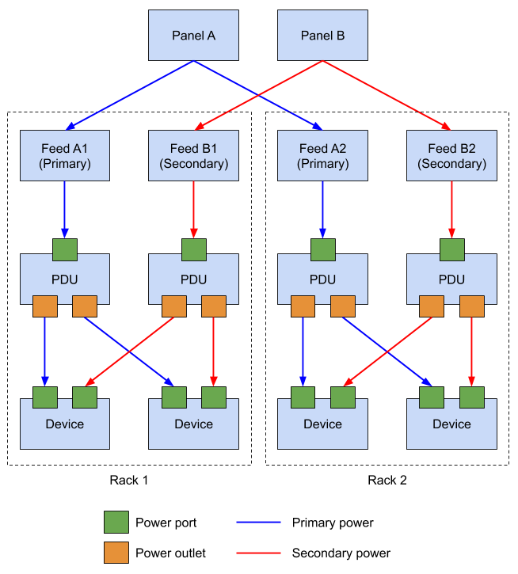

# Rastreamento de Energia

!!! info

    **English (en):** This page was not translated yet!
    **Portuguese (pt-br):** Essa página não foi traduzida ainda!

As part of its DCIM feature set, NetBox supports modeling facility power as discrete power panels and feeds. These are most commonly used to document power distribution within a data center, but can serve more traditional environments as well.

## Power Panels

A power panel is the furthest upstream power element modeled in NetBox. It typically represents a power distribution panel (or breaker panel) where facility power is split into multiple discrete circuits, which are modeled as feeds.

Each power panel is associated with a site, and may optionally be associated with a particular location within that site. There is no limit to how many power feeds a single panel can supply, however both of these object types should map to real-world objects.

## Power Feeds

A power feed represents a discrete power circuit originating from an upstream power panel. Each power feed can be assigned a name, operational status, and various electrical characteristics such as supply (AC or DC), voltage, amperage, and so on.

A device power port can be connected to a power feed via a cable. Only one port can be connected to a feed: Where multiple devices draw power from the same feed, a power distribution unit (PDU) must be modeled as an individual device mapping a power port to multiple power outlets to which the downstream devices can connect (as in the example above).

!!! tip "Primary and Redundant Power"
    Each power feed in NetBox is assigned a type: primary or redundant. This allows easily modeling redundant power distribution topologies. In scenarios involving only a single, non-redundant power supply, mark all power feeds as primary.