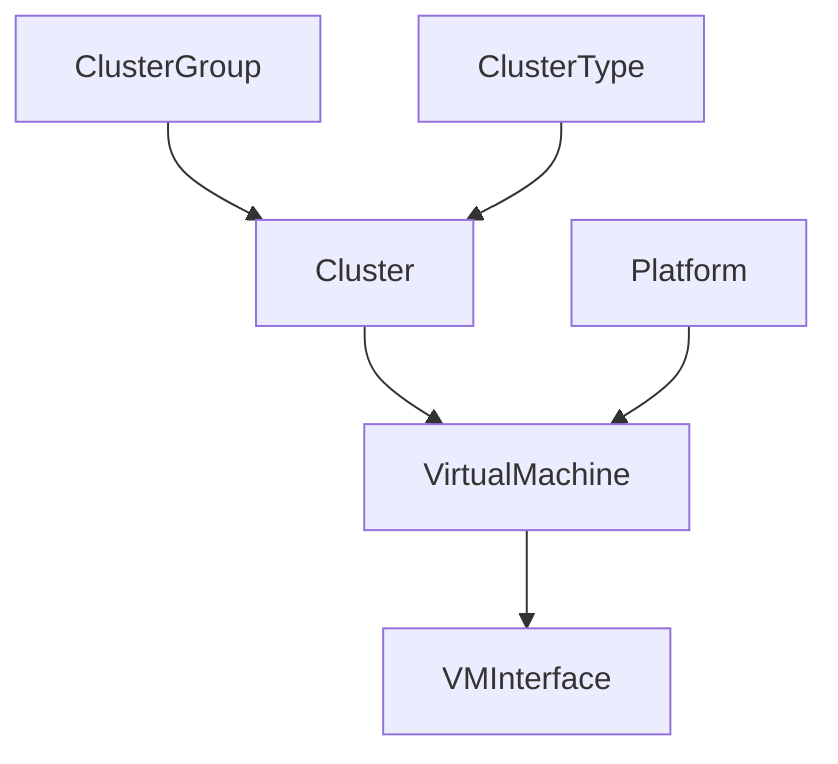

# Virtualização (Virtualization)

!!! info

    **English (en):** This page was not translated yet!
    **Portuguese (pt-br):** Essa página não foi traduzida ainda!

Virtual machines and clusters can be modeled in NetBox alongside physical infrastructure. IP addresses and other resources are assigned to these objects just like physical objects, providing a seamless integration between physical and virtual networks.

## Clusters

A cluster is one or more physical host devices on which virtual machines can run. Each cluster must have a type and operational status, and may be assigned to a group. (Both types and groups are user-defined.) Each cluster may designate one or more devices as hosts, however this is optional.

## Virtual Machines

A virtual machine is a virtualized compute instance. These behave in NetBox very similarly to device objects, but without any physical attributes. For example, a VM may have interfaces assigned to it with IP addresses and VLANs, however its interfaces cannot be connected via cables (because they are virtual). Each VM may also define its compute, memory, and storage resources as well.