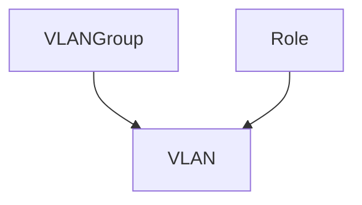

# Gerenciamento de VLANs

!!! info

    **English (en):** This page was not translated yet!
    **Portuguese (pt-br):** Essa página não foi traduzida ainda!

Complementing its IPAM capabilities, NetBox also tracks VLAN information to assist with layer two network configurations. VLANs are defined per IEEE 802.1Q and related standards, and can be assigned to groups and functional roles.

## VLAN Groups

A VLAN group is a collection of VLANs defined within a particular scope. Each VLAN group can be associated with a particular site, location, rack, or similar object to indicate its domain, and designates a minimum and maximum VLAN ID within the group. (By default, these are the standard minimum and maximum values of 1 and 4094, respectively.)

Within a group, each VLAN must have a unique ID and name. There is no limit to how many groups can be created per scope.

## VLANs

NetBox models VLANs according to their definition under IEEE 802.1Q, with a 12-bit VLAN ID and a name. Each VLAN also has an operational status, and may be assigned a function role, just like prefixes. Each VLAN can be assigned to a VLAN group or site to convey the domain in which the VLAN exists.

Once defined, VLANs can be associated with device and virtual machine interfaces. Each interface can be assigned an 802.1Q mode (access or tagged), and the relevant VLANs can be applied as tagged or untagged.