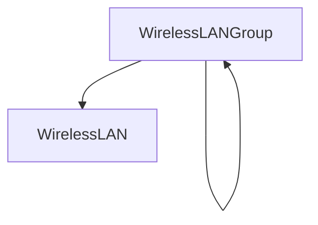

# Wireless (Wi-Fi)

!!! info

    **English (en):** This page was not translated yet!
    **Portuguese (pt-br):** Essa página não foi traduzida ainda!

Just as NetBox provides robust modeling for physical cable plants, it also supports modeling wireless LANs and point-to-point links.

## Wireless LANs

A wireless LAN is a multi-access network shared by multiple wireless clients, identified by a common service set identifier (SSID) and authentication parameters. Wireless LANs can be organized into self-nesting groups, and each wireless LAN may optionally be bound to a particular VLAN. This allows easily mapping wireless networks to their wired counterparts.

Authentication attributes for wireless LANs include:

* **Type** - Open, WEP, WPA, etc.
* **Cipher** - Auto, TKIP, or AES
* **Pre-shared key (PSK)** - The secret key configured on all participating clients

The definition of authentication parameters is optional.

## Wireless Links

Whereas a wireless LAN represents a physical multi-access segment with any number of clients, a wireless link is a point-to-point connection between exactly two stations. These links behave much like cables, but more accurately model the nature of wireless communications.

Like wireless LANs, wireless links also have an SSID and (optional) authentication attributes.