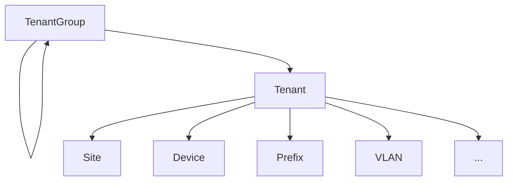
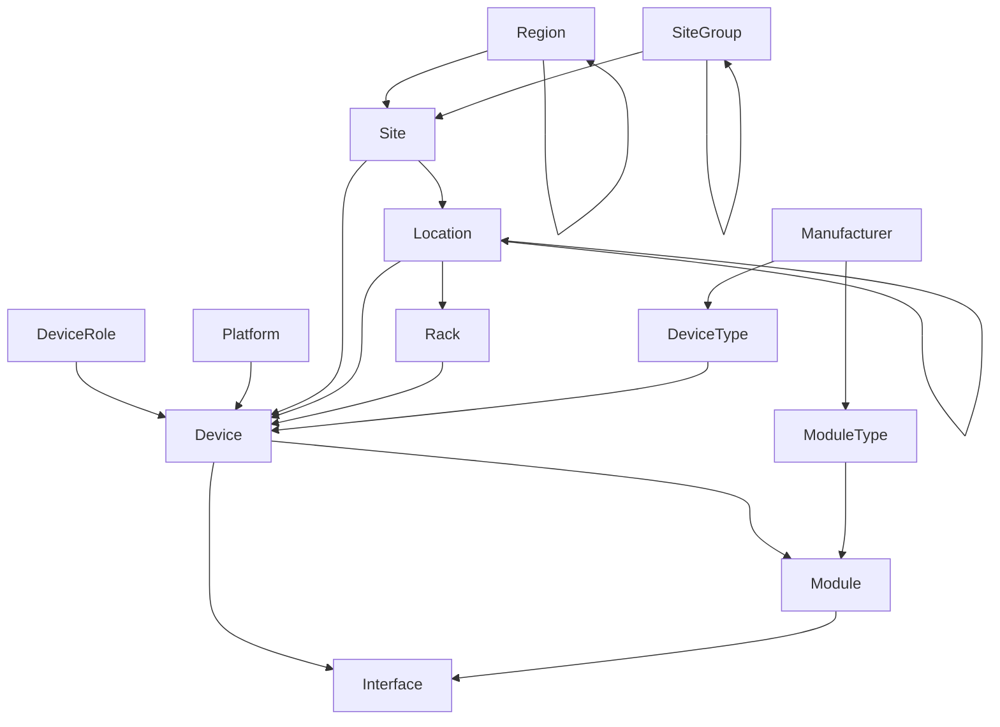
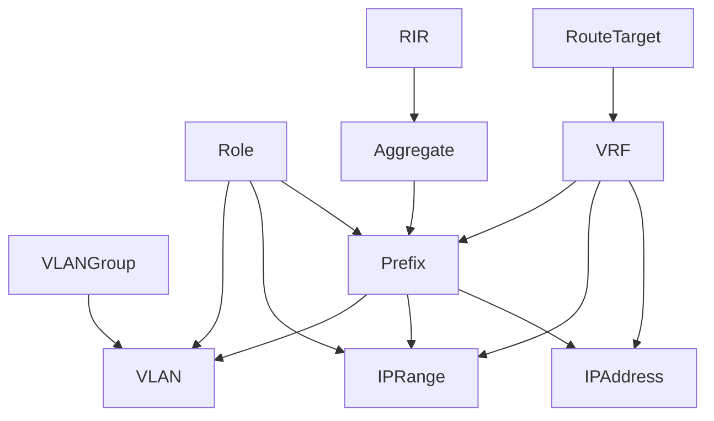
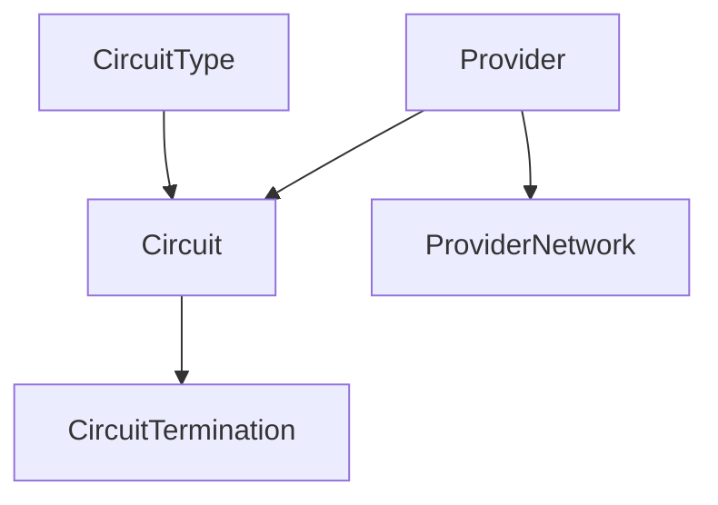
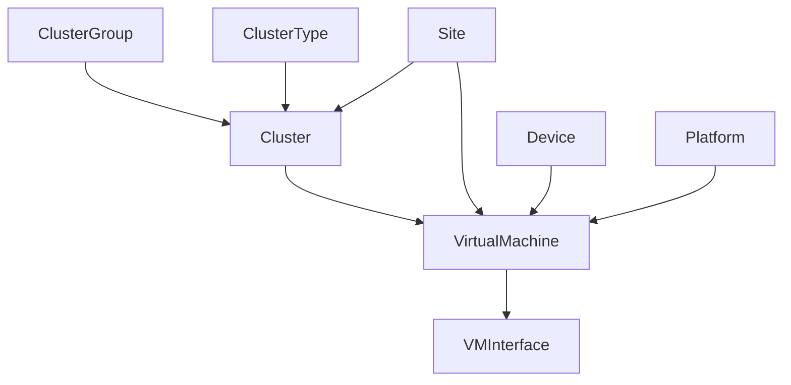

# Planejamento seus Passos

<<<<<<< HEAD
Esse guia resume os passos necessários para fazer o planejamento de migração para o NetBox. Embora é feito sobre o contexto de uma instalação nova, a abordagem geral esboçada aqui funciona normalmente para a adição de novos dados ao deploy (instalação) existente do NetBox.

## Identifique as Atuais Fontes de Verdade (Current Source of Truth)

Antes de começar o uso do NetBox para os seus próprios dados, é crucial primeiro entender onde estão as fontes de verdade (dados) existentes. Uma "fonte de verdade" (source of truth) é justamente qualquer repositório de dados que é autoridade para aquele domínio específico. Por exemplo, você pode ter uma planilha que mapeia todos os endereços IP em uso na sua rede. Enquanto todo mundo concordar que essa planilha é _autoritativa_ para a rede inteira, isso se torna a fonte de verdade (source of truth) para os prefixos de IP de sua rede.

Qualquer coisa pode ser a fonte de verdade (source of truth), se estas duas condições existirem:

1. Existe um acordo entre todos os participantes relevantes que essa fonte de verdade está correta.
2. O domínio que ela está aplica é definido.

<!-- TODO: Example SoT -->

Dedique algum tempo para mapear todas as suas fontes de verdades atuais de sua infraestrutura. Na entativa de catalogar e categorizar essas fontes de verdade, você provavelmente terá alguns desafios, como:

* **Múltiplas fontes conflitantes** para um domínio específico. Por exemplo, devem existir múltiplas versões de sua planilha circulando entre as pessoas, odne cada uma tem um grupo de dados conflitantes, provavelmente.
* **Fontes com domínios específicos.** Você pode encontrar um time diferente dentro de sua organização que utiliza ferramentas para o mesmo propósito, com uma definição de quando deve ser utilizada.
* **Formatos de dados inacessíveis.** Algumas ferramentas servem melhor para um uso programático que outras. Por exemplo, planilhas são normalmente fácies de fazer o "parse" e exportar, no enquanto páginas em wikis ou aplicações similares são normalmente difíceis de "consumir".
* **Não há nenhuma fonte de verdade.** Às vezes você irá encontrar uam fonte de verdade que simplesmente não existe para um domínio específico. Por exemplo, ao configurar endereços IP, operadores podem apenas presumir que existe um IP disponível de certa subrede sem nunca registrar o uso deste mesmo endereço IP.

Veja se você consegue identificar cada domínio de dados da infraestrutura da sua organização, e a fonte de verdade de cada. Uma vez que você tenha juntado isso, você precisará detarminar quais dados pertencem ao NetBox.

## Determine os Dados para Migrar

Como regra geral, para determinar os dados que serão movidos para o NetBox baseiam-se em: se existe um modelo (model) para isso, esse dado pertence ao NetBox. Por exemplo, o NetBox tem modelos relacionados a racks, dispositivos (devices), cabos, prefixos IP, VLANs e por aí vai. Eles têm o uso bem "direto". No entanto, você inveitavelmente irá chegar nos limites do modelo de dados do NetBox e questionar quais dados adicionais podem fazer sentido registrar no NetBox. Por exemplo, você pode querer que o NetBox sirva como fonte de verdade para registros DNS e servidores DHCP, ainda que não necessariamente esteja no escopo nativo do projeto.

O NetBox fornece dois mecanismos para extender seu modelo de dados (data model). O primeiro é os campos customizados (custom fields): A maioria dos modelos suportam campos de dados adicionais para armazenar informações adicionais aos campos nativos. Por exemplo, você pode querer adicionar um campo de "inventory ID" (ID do inventári) para o modelo do dispositivo (device model).

Dito isso, não faz sentido migrar todos os domínios de dados par ao NetBox. Por exemplo, muitas organizações optam por usar somente os componentes IPAM ou somente os componentes DCIM do NetBox, e integrar as outras fontes de verdade de diferentes domínios. Isso é uma abordagem muito válida (desde que todos os envolvidos concordem quais ferramentas são autoritativas (possuem autoridade) para cada domínio de dados.). Por fim, você irá precisar pesar o valor de ter modelos de dados não nativos no NetBox contra o esforço necessário para definir e manter esses modelos.

Considere que o NetBox está sob constante desenvolvimento. Embora a versão atual possa não suportar um tipo particular de objeto, existem planos para adicionar suporte a isso em versões futuras. (E mesmo que não haja, considere criar uma requisição de função/característica (feature request) citando o seu caso de uso, em particular).

## Validando Dados Externos

O último passo antes de migrar os dados para o NetBox é a **validação** mais crucial. O princípio GIGO (garbage in, garbage out) está no seu efeito máximo: A sua foonte de verdade é tão boa quanto os dados que ela armazena. Enquanto que o NetBox é uma ferramenta de validação de dados poderosa (incluindo o suporte de regras de validação customizada), oque irá decidir seu poder é o operador humano adicionando e dando a manutenção correta aos dados. Por exemplo, o NetBox pode validar a conexão de cabo entre duas interfaces, mas não pode dizer se o cabo _deveria ou não existir_.

Aqui está algumas dicas para ajudar na garantia que somente dados válidos serão importados ao NetBox:

* Garanta que você está começando com um dado completo e bem formatado. JSON ou CSV são altamente recomendados para uma melhor portabilidade.
* Considere definir regras de validação customizados dentro do NetBox antes de realizara importação. (Por exemplo, formar o esquema de nomes dos dispositivos.)
* Utilize scripts customizados para auomaticamente popular dados padronizados. (Por exemplo, para automaticamente criar um grupo de VLANs padrões pada cada site.)

Há vários métodos disponíveis para a importação de dados no NetBox, os quais nós iremos cobrir na próxima seção.
There are several methods available to import data into NetBox, which we'll cover in the next section.

## Ordem das Operações

Ao começar com um banco de dados limpo, pode não ser claro logo de início por onde começar. Muitos modelos dentro do NetBox dependem da criação de outros tipos. Por exemplo, você não pode criar um tipo de dispositivo (device type) até que tenha criado seu fabricante (manufacturer).

Abaixo está a ordem recomendada pela qual os objetos do NetBox devem ser criados ou importados. Enquanto que não é necessário seguir essa lista na ordem exata, fazer desta maneira irá ajudar a ter um trabalho fluído. 

1. Grupos de Locação (Tenant Groups) e Locatários (Tenants)
2. Regiões, Grupos de Locais (Site Groups), Locais (Sites) e Localizações (Locations)
3. Funções de cada Rack (Rack Roles) e Racks em si
4. Fabricantes (Manufacturers), Tipos de Dispositivos (Device Types), Tipos de Módulos (Module Types)
5. Plataformas (Sistemas), Funções do Dispositivo (Device Roles)
6. Dispositivos e Módulos
7. Fornecedores (Provider) e Redes de Fornecedor 
8. Tipos de Circuitos e Circuitos
9. Grupos de Wireless LAN (WiFi) e Wireless
10. Route targets & VRFs
11. RIRs e Agregados (aggregates)
12. Funções de cada IP/VLAN
13. Prefixos, Ranges de IP e endereços IP
14. Grupos de VLAN & VLANs
15. Tipos de Clusters, Grupos de Cluster e Clusters
16. Máquinas Virtuais (Virtual Machines) e interfaces de VMs

Isso não é uma lista que inclui tudo, mas deve ser suficiente para iniciar a importação de dados. Além disso, a ordem pela qual os objetos são adicionados não tem qualquer impacto.

Os gráficos abaixo ilustram algumas das dependências principais entre os diferentes modelos do NetBox, para referência.

!!! note Modelos Auto-Aninhados (Self-Nesting)

    Cada modelo no gráfico abaixo que mostra uma flecha em looping apontando para si mesmo pode ser aninhado em uma hierarquia recursiva. Por exemplo, você pode ter regiões que representam tanto países, quanto cidades, que posteriormente pode ser uma aninhada (atrelada) à outra.

### Tenancy (Locação)
=======
!!! info

    **English (en):** This page was not translated yet!
    **Portuguese (pt-br):** Essa página não foi traduzida ainda!

This guide outlines the steps necessary for planning a successful migration to NetBox. Although it is written under the context of a completely new installation, the general approach outlined here works just as well for adding new data to existing NetBox deployments.

## Identify Current Sources of Truth

Before beginning to use NetBox for your own data, it's crucial to first understand where your existing sources of truth reside. A "source of truth" is really just any repository of data that is authoritative for a given domain. For example, you may have a spreadsheet which tracks all IP prefixes in use on your network. So long as everyone involved agrees that this spreadsheet is _authoritative_ for the entire network, it is your source of truth for IP prefixes.

Anything can be a source of truth, provided it meets two conditions:

1. It is agreed upon by all relevant parties that this source of data is correct.
2. The domain to which it applies is well-defined.

<!-- TODO: Example SoT -->

Dedicate some time to take stock of your own sources of truth for your infrastructure. Upon attempting to catalog these, you're very likely to encounter some challenges, such as:

* **Multiple conflicting sources** for a given domain. For example, there may be multiple versions of a spreadsheet circulating, each of which asserts a conflicting set of data.
* **Sources with no domain defined.** You may encounter that different teams within your organization use different tools for the same purpose, with no normal definition of when either should be used.
* **Inaccessible data formatting.** Some tools are better suited for programmatic usage than others. For example, spreadsheets are generally very easy to parse and export, however free-form notes on wiki or similar application are much more difficult to consume.
* **There is no source of truth.** Sometimes you'll find that a source of truth simply doesn't exist for a domain. For example, when assigning IP addresses, operators may be just using any (presumed) available IP from a subnet without ever recording its usage.

See if you can identify each domain of infrastructure data for your organization, and the source of truth for each. Once you have these compiled, you'll need to determine what belongs in NetBox.

## Determine What to Move

The general rule when determining what data to put into NetBox is this: If there's a model for it, it belongs in NetBox. For instance, NetBox has purpose-built models for racks, devices, cables, IP prefixes, VLANs, and so on. These are very straightforward to use. However, you'll inevitably reach the limits of NetBox's data model and question what additional data might make sense to record in NetBox. For example, you might wonder whether NetBox should function as the source of truth for infrastructure DNS records or DHCP scopes.

NetBox provides two core mechanisms for extending its data model. The first is custom fields: Most models in NetBox support the addition of custom fields to hold additional data for which a built-in field does not exist. For example, you might wish to add an "inventory ID" field to the device model. The second mechanism is plugins. Users can create their own plugins to introduce entirely new models, views, and API endpoints in NetBox. This can be incredibly powerful, as it enables rapid development and tight integration with core models.

That said, it doesn't always make sense to migrate a domain of data to NetBox. For example, many organizations opt to use only the IPAM components or only the DCIM components of NetBox, and integrate with other sources of truth for different domains. This is an entirely valid approach (so long as everyone involved agrees which tool is authoritative for each domain). Ultimately, you'll need to weigh the value of having non-native data models in NetBox against the effort required to define and maintain those models.

Consider also that NetBox is under constant development. Although the current release might not support a particular type of object, there may be plans to add support for it in a future release. (And if there aren't, consider submitting a feature request citing your use case.)

## Validate Existing Data

The last step before migrating data to NetBox is the most crucial: **validation**. The GIGO (garbage in, garbage out) principle is in full effect: Your source of truth is only as good as the data it holds. While NetBox has very powerful data validation tools (including support for custom validation rules), ultimately the onus falls to a human operator to assert what is correct and what is not. For example, NetBox can validate the connection of a cable between two interfaces, but it cannot say whether the cable _should_ be there.

Here are some tips to help ensure you're only importing valid data into NetBox:

* Ensure you're starting with complete, well-formatted data. JSON or CSV is highly recommended for the best portability.
* Consider defining custom validation rules in NetBox prior to import. (For example, to enforce device naming schemes.)
* Use custom scripts to automatically populate patterned data. (For example, to automatically create a set of standard VLANs for each site.)

There are several methods available to import data into NetBox, which we'll cover in the next section.

## Order of Operations

When starting with a completely empty database, it might not be immediately clear where to begin. Many models in NetBox rely on the advance creation of other types. For example, you cannot create a device type until after you have created its manufacturer.

Below is the (rough) recommended order in which NetBox objects should be created or imported. While it is not required to follow this exact order, doing so will help ensure the smoothest workflow.

1. Tenant groups and tenants
2. Regions, site groups, sites, and locations
3. Rack roles and racks
4. Manufacturers, device types, and module types
5. Platforms and device roles
6. Devices and modules
7. Providers and provider networks
8. Circuit types and circuits
9. Wireless LAN groups and wireless LANs
10. Route targets and VRFs
11. RIRs and aggregates
12. IP/VLAN roles
13. Prefixes, IP ranges, and IP addresses
14. VLAN groups and VLANs
15. Cluster types, cluster groups, and clusters
16. Virtual machines and VM interfaces

This is not a comprehensive list, but should suffice for the initial data imports. Beyond these, it the order in which objects are added doesn't have much if any impact.

The graphs below illustrate some of the core dependencies among different models in NetBox for your reference.

!!! note "Self-Nesting Models"
    Each model in the graphs below which show a looping arrow pointing back to itself can be nested in a recursive hierarchy. For example, you can have regions representing both countries and cities, with the latter nested underneath the former.

### Tenancy
>>>>>>> a67cb14119d9c73ba16bcc23c76b40d95620a0d0

<<<<<<< HEAD
### Locais (Sites) & Racks & Dispositivos (Racks)
=======
### Sites, Racks, and Devices
>>>>>>> a67cb14119d9c73ba16bcc23c76b40d95620a0d0

<<<<<<< HEAD
### VRFs, Prefixos, IP Addresses, and VLANs
=======
### VRFs, Prefixes, IP Addresses, and VLANs
>>>>>>> a67cb14119d9c73ba16bcc23c76b40d95620a0d0

<<<<<<< HEAD
### Circuitos
=======
### Circuits
>>>>>>> a67cb14119d9c73ba16bcc23c76b40d95620a0d0

<<<<<<< HEAD
### Clusters & Máquinas Virtuais
=======
### Clusters and Virtual Machines
>>>>>>> a67cb14119d9c73ba16bcc23c76b40d95620a0d0

