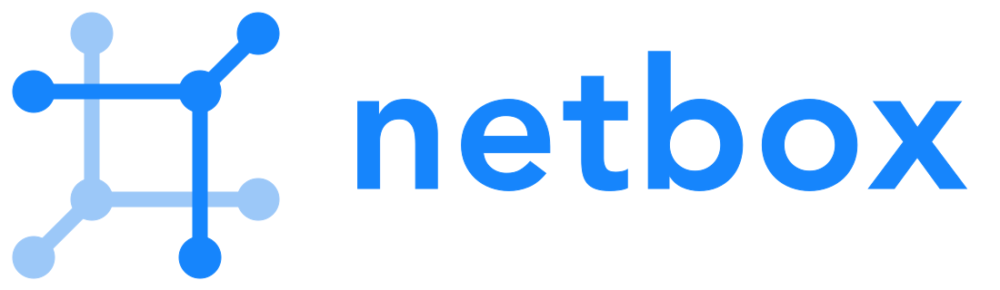
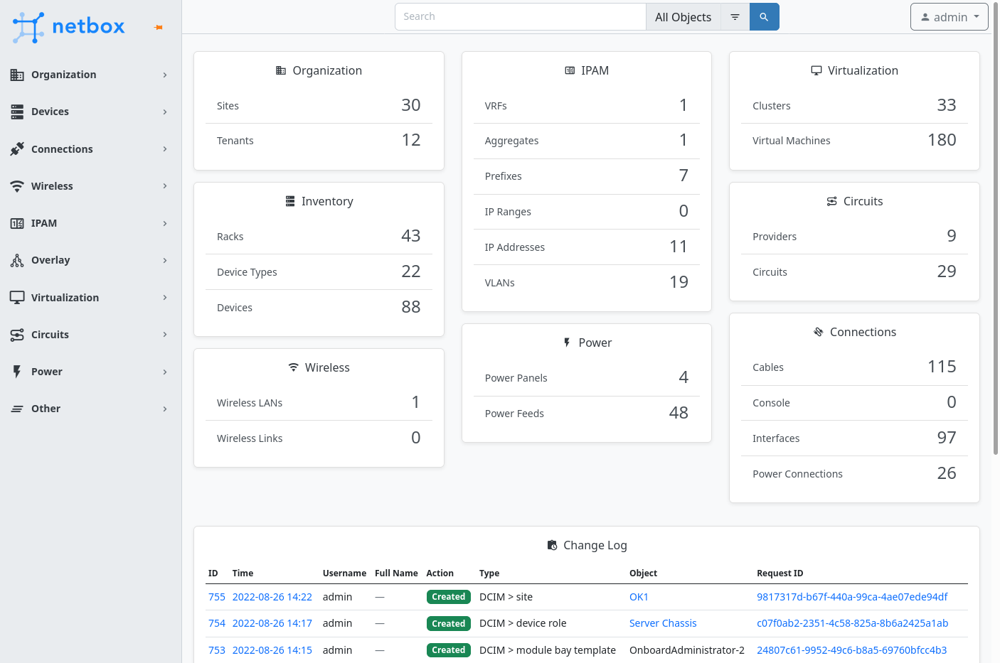

# A mais completa ferramenta de Network Source of Truth

!!! warning

    **There is no relation to [Netbox Labs](https://netboxlabs.com) or its official repo's.** It is just a effort to increase brazilian community base.

    If you are portuguese native speaker and was able to easily read this warning, I highly recommend you to continue read the [Netbox Offial Docs in English](https://docs.netbox.dev)! It will surely be more productive to your learning.

Netbox é a solução lider para modelagem e **documentação das redes** modernas. Combinando as disciplinas tradicionais de gerência de **endereçamento IP (IPAM)** e **gerenciamento de infraestrutura de datacenter (DCIM)** com **API** e extensões poderosas, NetBox fornece o **"source of truth"** (fonte de verdade) ideal para a **automação de rede**. Continue lendo e descubra o porquê de milhares de organizações ao redor do mundo colocam o Netbox no coração de suas infraestruturas.

## <i class="material-icons">server-network</i> Feito para Redes (Networks)

Diferente de outros CMDBs (configuration management database), NetBox fez uma curadoria dos modelos de dados que provê especificamente as necessidades dos engenheiros e operadores de rede. Entrega uma variedade de tipos de objeto cuidadosamente feito para melhor servir as necessidades do design de infraestrutura e documentação. Essas características cobrem todas as vertentes de das tecnologias de rede, desde gerenciamento de endereços IP até cabeamento e overlays, e ainda mais:
- Regiões hierárquicas, sites, e localizações
- Racks, dispositivos, e componentes de dispositivos
- Cabos e conexões wireless (Wi-Fi)
- Mapeamento da distribuição de energia
- Máquinas virtuais e clusters
- Prefixos IP, ranges e endereços
- VRFs e route targets
- Grupos FHRP (VRRP, HSRP, etc.)
- Números de AS (ASN)
- VLANs e escopo de grupos de VLAN
- L2VPN overlays
- Atrelação de locação (aluguel)
- Gerencimento de contatos

## <i class="material-icons">tools</i> Customizável e Extensível
Em adição ao seu modelo de dados robusto e extensivo, **NetBox oferece uma grande quantidade de mecanismos que podem ser customizados e extendidos**. Sua arquitetura robusta de plugins permite que os usuários extendam a aplicação para estar em conformidade com suas necessidades mínimas de esforço de desenvolvimento.
- Custom fields (Campos Customizados)
- Custom model validation (Validação customizada de modelos de dados)
- Export templates (Exportação de templates)
- Webhooks
- Plugins
- REST & GraphQL APIs

## <i class="material-icons">lock-open</i> Sempre aberto (opensource)
Porque o NetBox é uma **aplicação open source** licenciada pela [Apache 2](https://www.apache.org/licenses/LICENSE-2.0.html), seu código fonte inteiro é acessível pelos usuários finais que utilizam o sistema e não existe risco algum de [vendor lock-in](https://pt.wikipedia.org/wiki/Aprisionamento_tecnol%C3%B3gico). Além disso, **o desenvolvimento do NetBox é completamente público**, movido pela comunidade, onde todos podem contribuir.

## <i class="material-icons">simple-python</i> Feito em Python
Netbox é feito pelo framework muito popular **[Django](http://www.djangoproject.com/)** da **linguagem Python**, que já é a linguagem favorita entre os engenheiros de rede. Usuários podem alavancar suas habilidades existentes de criar código em Python para extender as já existentes funcionalidades do NetBox através de **scripts customizados** e **plugins**.

## :::i mateiral-icons flag ::: Começando com o Netbox?
- Se quer pular a instalação, experimente a [versão demo](https://demo.netbox.dev/) disponível publicamente
- O [guia de instalação](https://docs.netbox.dev/en/stable/installation/) lhe ajudará a fazer sua própria instalação e torná-la disponível (up and running)
- Ou tente a [imagem Docker](https://github.com/netbox-community/netbox-docker) feita pela comunidade para uma abordagem "low-touch"
- [NetBox Cloud](https://netboxlabs.com/netbox-cloud) é uma solução ofertada pela [NetBox Labs](https://netboxlabs.com/)