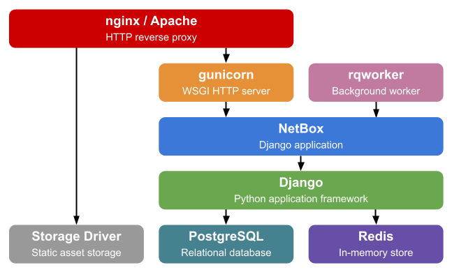

# Instalação

As instruções de instalação fornecidas aqui foram testadas para funcionar no Ubuntu 20.04 e CentOS 8.3. Comandos necessários em particular para instalar dependências em outras distribuições podem variar de forma significativa. Infelizmente, isto está fora do controle dos mantenedores do NetBox. Por favor, consulte a documentação da sua distribuição caso precise de assistência para qualquer erro que pode ocorrer.

<iframe width="560" height="315" src="https://www.youtube.com/embed/_y5JRiW_PLM" title="YouTube video player" frameborder="0" allow="accelerometer; autoplay; clipboard-write; encrypted-media; gyroscope; picture-in-picture" allowfullscreen></iframe>

As seções abaixo detalham como configurar uma instância nova do NetBox:

1. [Banco de Dados PostgreSQL](1-postgresql.md)
1. [Redis](2-redis.md)
3. [Componentes do NetBox](3-netbox.md)
4. [Gunicorn](4-gunicorn.md)
5. [Servidor HTTP](5-http-server.md)
6. [Autenticação via LDAP](6-ldap.md) (optional)

## Dependências (Requirements)

| Dependência | Versão Mínima  |
|------------|-----------------|
| Python     | 3.8             |
| PostgreSQL | 11              |
| Redis      | 4.0             |

Abaixo está uma visão geral simplificada da stack de aplicações do NetBox para referência:

## Fazendo o Upgrade

Se você estiver fazendo o upgrade de uma instalação existente, por gentileza consulte o [Guia de Upgrade](upgrading.md).