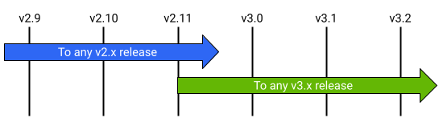

# Fazendo Upgrade do NetBox para Última Versão

!!! info

    **English (en):** This page was not translated yet!
    **Portuguese (pt-br):** Essa página não foi traduzida ainda!

Upgrading NetBox to a new version is pretty simple, however users are cautioned to always review the release notes and save a backup of their current deployment prior to beginning an upgrade.

NetBox can generally be upgraded directly to any newer release with no interim steps, with the one exception being incrementing major versions. This can be done only from the most recent _minor_ release of the major version. For example, NetBox v2.11.8 can be upgraded to version 3.3.2 following the steps below. However, a deployment of NetBox v2.10.10 or earlier must first be upgraded to any v2.11 release, and then to any v3.x release. (This is to accommodate the consolidation of database schema migrations effected by a major version change).

[](../media/installation/upgrade_paths.png)

!!! warning "Perform a Backup"
    Always be sure to save a backup of your current NetBox deployment prior to starting the upgrade process.

## 1. Review the Release Notes

Prior to upgrading your NetBox instance, be sure to carefully review all [release notes](../release-notes/index.md) that have been published since your current version was released. Although the upgrade process typically does not involve additional work, certain releases may introduce breaking or backward-incompatible changes. These are called out in the release notes under the release in which the change went into effect.

## 2. Update Dependencies to Required Versions

NetBox v3.0 and later require the following:

| Dependency | Minimum Version |
|------------|-----------------|
| Python     | 3.8             |
| PostgreSQL | 11              |
| Redis      | 4.0             |

## 3. Install the Latest Release

As with the initial installation, you can upgrade NetBox by either downloading the latest release package or by cloning the `master` branch of the git repository. 

!!! warning
    Use the same method as you used to install NetBox originally

If you are not sure how NetBox was installed originally, check with this command:

```
ls -ld /opt/netbox /opt/netbox/.git
```

If NetBox was installed from a release package, then `/opt/netbox` will be a
symlink pointing to the current version, and `/opt/netbox/.git` will not
exist.  If it was installed from git, then `/opt/netbox` and
`/opt/netbox/.git` will both exist as normal directories.

### Option A: Download a Release

Download the [latest stable release](https://github.com/netbox-community/netbox/releases) from GitHub as a tarball or ZIP archive. Extract it to your desired path. In this example, we'll use `/opt/netbox`.

Download and extract the latest version:

```no-highlight
wget https://github.com/netbox-community/netbox/archive/vX.Y.Z.tar.gz
sudo tar -xzf vX.Y.Z.tar.gz -C /opt
sudo ln -sfn /opt/netbox-X.Y.Z/ /opt/netbox
```

Copy `local_requirements.txt`, `configuration.py`, and `ldap_config.py` (if present) from the current installation to the new version:

```no-highlight
sudo cp /opt/netbox-X.Y.Z/local_requirements.txt /opt/netbox/
sudo cp /opt/netbox-X.Y.Z/netbox/netbox/configuration.py /opt/netbox/netbox/netbox/
sudo cp /opt/netbox-X.Y.Z/netbox/netbox/ldap_config.py /opt/netbox/netbox/netbox/
```

Be sure to replicate your uploaded media as well. (The exact action necessary will depend on where you choose to store your media, but in general moving or copying the media directory will suffice.)

```no-highlight
sudo cp -pr /opt/netbox-X.Y.Z/netbox/media/ /opt/netbox/netbox/
```

Also make sure to copy or link any custom scripts and reports that you've made. Note that if these are stored outside the project root, you will not need to copy them. (Check the `SCRIPTS_ROOT` and `REPORTS_ROOT` parameters in the configuration file above if you're unsure.)

```no-highlight
sudo cp -r /opt/netbox-X.Y.Z/netbox/scripts /opt/netbox/netbox/
sudo cp -r /opt/netbox-X.Y.Z/netbox/reports /opt/netbox/netbox/
```

If you followed the original installation guide to set up gunicorn, be sure to copy its configuration as well:

```no-highlight
sudo cp /opt/netbox-X.Y.Z/gunicorn.py /opt/netbox/
```

### Option B: Clone the Git Repository

This guide assumes that NetBox is installed at `/opt/netbox`. Pull down the most recent iteration of the master branch:

```no-highlight
cd /opt/netbox
sudo git checkout master
sudo git pull origin master
```

!!! info "Checking out an older release"
    If you need to upgrade to an older version rather than the current stable release, you can check out any valid [git tag](https://github.com/netbox-community/netbox/tags), each of which represents a release. For example, to checkout the code for NetBox v2.11.11, do:

        sudo git checkout v2.11.11

## 4. Run the Upgrade Script

Once the new code is in place, verify that any optional Python packages required by your deployment (e.g. `napalm` or `django-auth-ldap`) are listed in `local_requirements.txt`. Then, run the upgrade script:

```no-highlight
sudo ./upgrade.sh
```

!!! warning
    If the default version of Python is not at least 3.8, you'll need to pass the path to a supported Python version as an environment variable when calling the upgrade script. For example:

    ```no-highlight
    sudo PYTHON=/usr/bin/python3.8 ./upgrade.sh
    ```

This script performs the following actions:

* Destroys and rebuilds the Python virtual environment
* Installs all required Python packages (listed in `requirements.txt`)
* Installs any additional packages from `local_requirements.txt`
* Applies any database migrations that were included in the release
* Builds the documentation locally (for offline use)
* Collects all static files to be served by the HTTP service
* Deletes stale content types from the database
* Deletes all expired user sessions from the database

!!! note
    If the upgrade script prompts a warning about unreflected database migrations, this indicates that some change has
    been made to your local codebase and should be investigated. Never attempt to create new migrations unless you are
    intentionally modifying the database schema.

## 5. Restart the NetBox Services

!!! warning
    If you are upgrading from an installation that does not use a Python virtual environment (any release prior to v2.7.9), you'll need to update the systemd service files to reference the new Python and gunicorn executables before restarting the services. These are located in `/opt/netbox/venv/bin/`. See the example service files in `/opt/netbox/contrib/` for reference.

Finally, restart the gunicorn and RQ services:

```no-highlight
sudo systemctl restart netbox netbox-rq
```

## 6. Verify Housekeeping Scheduling

If upgrading from a release prior to NetBox v3.0, check that a cron task (or similar scheduled process) has been configured to run NetBox's nightly housekeeping command. A shell script which invokes this command is included at `contrib/netbox-housekeeping.sh`. It can be linked from your system's daily cron task directory, or included within the crontab directly. (If NetBox has been installed in a nonstandard path, be sure to update the system paths within this script first.)

```shell
sudo ln -s /opt/netbox/contrib/netbox-housekeeping.sh /etc/cron.daily/netbox-housekeeping
```

See the [housekeeping documentation](../administration/housekeeping.md) for further details.