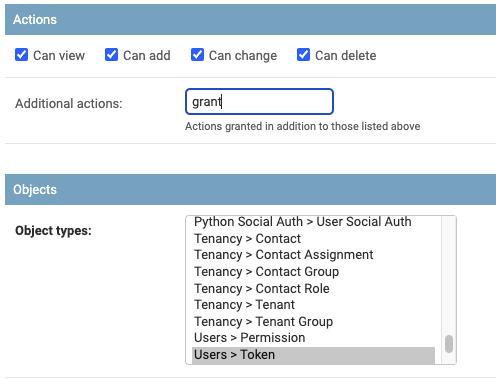

# Visão Geral da API REST

## O que é uma API REST?
 
REST significa [representational state transfer](https://en.wikipedia.org/wiki/Representational_state_transfer) (estado representacional de transferência). É um tipo particular de API que utiliza as requisições HTTP e [JavaScript Object Notation (JSON)](https://www.json.org/) para facilitar as operações de criação, obtenção, atualizaçã oe remoção (CRUD) em objetos dentro de uma aplicação. Cada tipo de operação é associado com um verbo particular do HTTP:

* `GET`: Obter um objeto ou lista de objetos
* `POST`: Criar um objeto
* `PUT` / `PATCH`: Modificar um objeto existente. `PUT` exige que todos os campos obrigatórios sejam especificados, enquanto que `PATCH` apenas espera que somente os campos que estão sendo modificados sejam especificados.
* `DELETE`: Deletar um objeto existente

Adicionalmente, o verbo `OPTIONS` podem ser usados para inspecionar um endpoint em particular da API REST e retornar todas as ações suportadas e seus parâmetros disponíveis.

Um dos benefócios primários de uma API REST é ser amigável para ser utilizada por humanos. Porque utiliza HTTP e JSON, que são muito fáceis de interagir com os dados do NetBox na linha de comando usando ferramentas conhecidas. Por exemplo, nós podemos requisitar um endereço IP do NetBox e obter a saida em JSON usando `curl` e `jq`. O comando seguinte faz uma requisição HTTP do tipo `GET` para requisitar informações sobre um endereço IP em particular, identificado pela sua chave primária, enquanto utiliza `jq` para apresentar os dados JSON "puros" retornados em um formato mais amigável. (Passar os dados em `jq` não é estritamente obrigatório, mas torna os dados bem mais legíveis.)

```no-highlight
curl -s http://netbox/api/ipam/ip-addresses/2954/ | jq '.'
```

```json
{
  "id": 2954,
  "url": "http://netbox/api/ipam/ip-addresses/2954/",
  "family": {
    "value": 4,
    "label": "IPv4"
  },
  "address": "192.168.0.42/26",
  "vrf": null,
  "tenant": null,
  "status": {
    "value": "active",
    "label": "Active"
  },
  "role": null,
  "assigned_object_type": "dcim.interface",
  "assigned_object_id": 114771,
  "assigned_object": {
    "id": 114771,
    "url": "http://netbox/api/dcim/interfaces/114771/",
    "device": {
      "id": 2230,
      "url": "http://netbox/api/dcim/devices/2230/",
      "name": "router1",
      "display_name": "router1"
    },
    "name": "et-0/1/2",
    "cable": null,
    "connection_status": null
  },
  "nat_inside": null,
  "nat_outside": null,
  "dns_name": "",
  "description": "Example IP address",
  "tags": [],
  "custom_fields": {},
  "created": "2020-08-04",
  "last_updated": "2020-08-04T14:12:39.666885Z"
}
```

Cada atributo do endereço IP é expressado como um atributo de um objeto JSON. Campos podem incluir seus próprios objetos aninhados, como é no caso do campo `assigned_object` acima. Todo objeto inclui uma chave primária nomeada de `id` que unicamente identifica-o dentro do banco de dados.

## Documentação Interativa

Uma documentação completa e interativa de todos os endpoints da API REST estão disnpóveis em uma instância rodando do NetBox em `/api/docs`. Essa interface fornece um sandbox conveniente para pesquisa e experimentação de endpoints específicos e os tipos de requsição (request types). A API em si pode ser explorada utilizando um navegador ao navegar pelo root `/api/`.

## Hierarquia de Endpoints

A API REST inteira do NetBox é hospedada abaixo do root da API em `https://<hostname>/<api>`. Essa estrutura de URL é dividida no nível root da aplicação: circuits, DCIM, extras, IPAM, plugins, tenancy, users, and virtualization. Dentro de cada aplicação, existe um caminho (path) separado de cada modelo.  Por exemplo, os objetos de provider e circuits estão localizados abaixo da aplicação "circuits":

* `/api/circuits/providers/`
* `/api/circuits/circuits/`

Da mesma forma, objetos de site, rack e device estão localizados abaixo ad aplicação "DCIM":

* `/api/dcim/sites/`
* `/api/dcim/racks/`
* `/api/dcim/devices/`

A hierarquia completa de endpoints disponíveis podem ser visualizadas ao navegar pelo root da API no navegador.

Cada modelo geralmente tem duas visualizações (views) associadas: a visualização de lista e a visualização detalhada. A visualização de lista é utilizada para obter múltiplos objetos e criar novos objetos. A visualização detalhada é utilizada para obter, atualizar ou deletar um objeto único existente. Todos os objetos são referenciados pelo seu valor número de chave primária (primary key) nomeado de `id` ou `pk`.

* `/api/dcim/devices/` - Lista os dispositivos existentes ou cria um novo dispositivo
* `/api/dcim/devices/123/` - Obtém, atualiza ou deleta um dispositivo com o ID 123

Listas de objetos podem ser filtradas utilizando um grupo de parâmetros de busca (query parameters). Por exemplo, para buscar todas as interfaces que pertencem ao dispositivo com ID 123:

```
GET /api/dcim/interfaces/?device_id=123
```

Veja a [documentação completa de filtros](../reference/filtering.md) para mais detalhes.

## Serialização (Serialization)

A API REST utiliza dois tipos de serializadores para representar cada modelo de dados: serializadores base e serializados aninhados. O serializador base é utilizado para apresentar uma visualização completa de um modelo. Isso inclui todos os campos da tabela do banco de dados do modelo em específico, enquanto pode incluir metadado adicional. Um serializador base inclui relacionamento de objetos pais, mas **não** inclui objetos filhos. Por exemplo, `VLANSerializer` inclui uma representação aninhada (nested) de seu `VLANGroup` pai (se houver um), mas não inclui qualquer `Prefixes` atrelado.

```json
{
    "id": 1048,
    "site": {
        "id": 7,
        "url": "http://netbox/api/dcim/sites/7/",
        "name": "Corporate HQ",
        "slug": "corporate-hq"
    },
    "group": {
        "id": 4,
        "url": "http://netbox/api/ipam/vlan-groups/4/",
        "name": "Production",
        "slug": "production"
    },
    "vid": 101,
    "name": "Users-Floor1",
    "tenant": null,
    "status": {
        "value": 1,
        "label": "Active"
    },
    "role": {
        "id": 9,
        "url": "http://netbox/api/ipam/roles/9/",
        "name": "User Access",
        "slug": "user-access"
    },
    "description": "",
    "display_name": "101 (Users-Floor1)",
    "custom_fields": {}
}
```

### Objetos Relacionados

Objetos relacionados (como os campos de `ForeignKey`) são representados utilizando serializadores aninhados. E um serializador aninhado fornece uma representação mínima de u m objeto, incluindo a URL direta e informações suficientes para exibir o objeto ao usuário. Ao performar ações de escrita (write) na API (`POST`, `PUT` & `PATCH`), objetos relacionados podem ser especificados seja pelo ID numérico (primary key), ou por um grupo de atributos que são suficientemente únicos para retornar o objeto desejado.

Por exemplo, ao criar um novo dispositivo, o rack pode ser especificado pelo ID do NetBox (PK):

```json
{
    "name": "MyNewDevice",
    "rack": 123,
    ...
}
```

Ou por um grupo de atributos aninhados que identifica de forma única o rack:

```json
{
    "name": "MyNewDevice",
    "rack": {
        "site": {
            "name": "Equinix DC6"
        },
        "name": "R204"
    },
    ...
}
```

Observe que se os parâmetros fornecidos não retornarem exatamente um único objeto, um erro de validação é acionado.

### Relações Genéricas

Alguns objetos dentro do NetBox têm atributos que podem referenciar um objeto de múltiplos tipos, conhecido como _generic relations_ (relacionamento genérico). Por exemplo, um endereço IP pode ser atribuído para tanto para a interface de um dispositivo _ou_ para a interface de uma máquina virtual. Ao criar essa associação pela API REST, nós devemos especificar dois atributos:

* `assigned_object_type` - O tipo do conteúdo do objeto atribuído, definido como `<app>.<model>`
* `assigned_object_id` - O ID númerico e único do objeto associado

Juntos, esses valores identificam um objeto único dentro do NetBox. O objeto associado (se houver) é representado pelo atributo `assigned_object` no modelo do endereço IP.

```no-highlight
curl -X POST \
-H "Authorization: Token $TOKEN" \
-H "Content-Type: application/json" \
-H "Accept: application/json; indent=4" \
http://netbox/api/ipam/ip-addresses/ \
--data '{
    "address": "192.0.2.1/24",
    "assigned_object_type": "dcim.interface",
    "assigned_object_id": 69023
}'
```

```json
{
    "id": 56296,
    "url": "http://netbox/api/ipam/ip-addresses/56296/",
    "assigned_object_type": "dcim.interface",
    "assigned_object_id": 69000,
    "assigned_object": {
        "id": 69000,
        "url": "http://netbox/api/dcim/interfaces/69023/",
        "device": {
            "id": 2174,
            "url": "http://netbox/api/dcim/devices/2174/",
            "name": "device105",
            "display_name": "device105"
        },
        "name": "ge-0/0/0",
        "cable": null,
        "connection_status": null
    },
    ...
}
```

Se queremos associar esse endereço IP para a interface de uma máquina virtual, ao invés, devemos mudar `assigned_object_type` para `virtualization.vminterface` e o ID do objeto que foi atualizado propriamente.

### Formato Resumido (Brief)

A maioria dos endpoints da API suportam um formato opcional resumido (ou "brief") que retorna somente uma representação mínima de cada objeto na resposta. Isso é útil quando você precisa somente uma lista de objetos disponíveis sem seus dados relacioandos, como quando estiver populando uma lista drop-down em um formulário. Por exemplo, o formato padrão (completo) de um endereço IP é algo como:

```
GET /api/ipam/prefixes/13980/

{
    "id": 13980,
    "url": "http://netbox/api/ipam/prefixes/13980/",
    "family": {
        "value": 4,
        "label": "IPv4"
    },
    "prefix": "192.0.2.0/24",
    "site": {
        "id": 3,
        "url": "http://netbox/api/dcim/sites/17/",
        "name": "Site 23A",
        "slug": "site-23a"
    },
    "vrf": null,
    "tenant": null,
    "vlan": null,
    "status": {
        "value": "container",
        "label": "Container"
    },
    "role": {
        "id": 17,
        "url": "http://netbox/api/ipam/roles/17/",
        "name": "Staging",
        "slug": "staging"
    },
    "is_pool": false,
    "description": "Example prefix",
    "tags": [],
    "custom_fields": {},
    "created": "2018-12-10",
    "last_updated": "2019-03-01T20:02:46.173540Z"
}
```

O formato resumido é algo muito mais conciso:

```
GET /api/ipam/prefixes/13980/?brief=1

{
    "id": 13980,
    "url": "http://netbox/api/ipam/prefixes/13980/",
    "family": 4,
    "prefix": "10.40.3.0/24"
}
```

O formato resumido é suportado para tanto lista de objetos ou objetos individuais.

### Tirando as Configurações de Contexto

Ao obter os dispositivos e máquinas virutais pela API REST, cada uma inclui sua própria [configuração de dados de contexto](../features/context-data.md), por padrão. Usuários com uma grande quantidade de dados de contexto (context data) normalmente enfrentará uma performance prejudicada quando estiver retornando múltiplos objetos, particularmente com páginas com grandes tamanhos. Para contornar isso, dados de contexto podem ser excluídos dos dados de resposta ao incluir o parâmetro `?exclude=config_context` na requisição. Esse parâemtro funciona tanto com visualizações de listas, quanto com visualizações detalhadas.

## Paginação (Pagination)

Respostas de API quem contém uma lista de objetos serão paginadas para eficiência. O objeto root do JSON retornado por um endpoint de lista contém os seguintes atributos:

* `count`: Número total de todos os objetos que dão match na query utilizada
* `next`: Um hyperlink para os resultados da próxima página (se houver)
* `previous`: Um hyperlink para os resultados da página anterior (se houver)
* `results`: A lista de objetos da página atual

Aqui está um exemplo de resposta página:

```
HTTP 200 OK
Allow: GET, POST, OPTIONS
Content-Type: application/json
Vary: Accept

{
    "count": 2861,
    "next": "http://netbox/api/dcim/devices/?limit=50&offset=50",
    "previous": null,
    "results": [
        {
            "id": 231,
            "name": "Device1",
            ...
        },
        {
            "id": 232,
            "name": "Device2",
            ...
        },
        ...
    ]
}
```

A página padrão é determinada pelo parâmetro de configuração [`PAGINATE_COUNT`](../configuration/default-values.md#paginate_count), que por padrão é 50. No entanto, isso pode ser sobreposto pela requisição ao especificar os parâmetros da busca (query) em `offset` e `limit`. Por exemplo, se você quiser obter 100 dispositivos ao mesmo tempo, você vai fazer uma requisição:

```
http://netbox/api/dcim/devices/?limit=100
```

O resposta retornará os dispositivos de 1 à 100. A URL fornecida no atributo `next` da resposta irá retornar os dispositivos de 101 até 200:

```json
{
    "count": 2861,
    "next": "http://netbox/api/dcim/devices/?limit=100&offset=100",
    "previous": null,
    "results": [...]
}
```

O número máximo de objetos que podem ser retornados é limitado pelo parâmetros de configuração [`MAX_PAGE_SIZE`](../configuration/miscellaneous.md#max_page_size), que é 1000, por padrão. Configurar para `0` ou `None` irá remover o limite máximo. O consumor da API pode passar `?limit=0` para obter _todos_ os objetos dando match com uma única requisição.

!!! warning Aviso

    Desabilitando o tamanho máximo da página introduz um potencial para requisições que utilizam os recursos de forma muito intensiva, já que uma única requisição API pode obter uma tabela inteira de um banco de dados.

## Interagindo com Objetos

### Obtendo Múltiplos Objetos

Para buscar (query) por uma lista de objetos no NetBox, realize uma requisição do tipo `GET` para o endpoint de _list_ (lista) do modelo. Objetos são listados abaixo do parâmetro `results` do objeto.

```no-highlight
curl -s -X GET http://netbox/api/ipam/ip-addresses/ | jq '.'
```

```json
{
  "count": 42031,
  "next": "http://netbox/api/ipam/ip-addresses/?limit=50&offset=50",
  "previous": null,
  "results": [
    {
      "id": 5618,
      "address": "192.0.2.1/24",
      ...
    },
    {
      "id": 5619,
      "address": "192.0.2.2/24",
      ...
    },
    {
      "id": 5620,
      "address": "192.0.2.3/24",
      ...
    },
    ...
  ]
}
```

### Obtendo um Único Objeto

Para buscar (query) por um objeto individual no NetBox, realize uma requisição do tipo `GET` para o ednpoint _detail_ (detalhado) do modelo, especificando seu ID numérico único.

!!! note Observação
    
    Observe que a "trailing slash" é obrigatória. Ocultá-la retornada um redirecionamento HTTP 302 (redirect).

```no-highlight
curl -s -X GET http://netbox/api/ipam/ip-addresses/5618/ | jq '.'
```

```json
{
  "id": 5618,
  "address": "192.0.2.1/24",
  ...
}
```

### Criando um Novo Objeto

Para criar um novo objeto, faça uma requisição do tipo `POST` para o endpoint _list_ do modelo com dados em JSON pertencentes ao objeto sendo criado. Observe que o token da API REST é necessário para todas as operações de escrita (write); veja a [seção de autenticação](#authenticating-to-the-api) para mais informações. Também certifique-se de definir o cabeçalho HTTP `Content-Type` para `application/json`.

```no-highlight
curl -s -X POST \
-H "Authorization: Token $TOKEN" \
-H "Content-Type: application/json" \
http://netbox/api/ipam/prefixes/ \
--data '{"prefix": "192.0.2.0/24", "site": 6}' | jq '.'
```

```json
{
  "id": 18691,
  "url": "http://netbox/api/ipam/prefixes/18691/",
  "family": {
    "value": 4,
    "label": "IPv4"
  },
  "prefix": "192.0.2.0/24",
  "site": {
    "id": 6,
    "url": "http://netbox/api/dcim/sites/6/",
    "name": "US-East 4",
    "slug": "us-east-4"
  },
  "vrf": null,
  "tenant": null,
  "vlan": null,
  "status": {
    "value": "active",
    "label": "Active"
  },
  "role": null,
  "is_pool": false,
  "description": "",
  "tags": [],
  "custom_fields": {},
  "created": "2020-08-04",
  "last_updated": "2020-08-04T20:08:39.007125Z"
}
```

### Criand Múltiplos Objetos

Para criar instâncias múltiplas de modelos utilizando uma única requisição, faça uma requisição do tipo `POST` para o endpoint _list_ (lista) do modelo representando cada instância à ser criada. Se houver sucesso, a resposta irá conter uma lista as instâncias recentemente criadas. O exemplo abaixo ilustra a criação de três novos sites (locais).

```no-highlight
curl -X POST -H "Authorization: Token $TOKEN" \
-H "Content-Type: application/json" \
-H "Accept: application/json; indent=4" \
http://netbox/api/dcim/sites/ \
--data '[
{"name": "Site 1", "slug": "site-1", "region": {"name": "United States"}},
{"name": "Site 2", "slug": "site-2", "region": {"name": "United States"}},
{"name": "Site 3", "slug": "site-3", "region": {"name": "United States"}}
]'
```

```json
[
    {
        "id": 21,
        "url": "http://netbox/api/dcim/sites/21/",
        "name": "Site 1",
        ...
    },
    {
        "id": 22,
        "url": "http://netbox/api/dcim/sites/22/",
        "name": "Site 2",
        ...
    },
    {
        "id": 23,
        "url": "http://netbox/api/dcim/sites/23/",
        "name": "Site 3",
        ...
    }
]
```

### Atualizando um Objeto

Para modificar um objeto que foi recentemente criada, faça uma requisição do tipo `PATCH` para o endpoint _detail_ (detalhado) do modelo especificando seu ID número único. Inclua qualquer dado que você precisa para atualizar um objeto. Assim como é na criação do objeto, os cabeçalhos `Authorization` e `Content-Type` podem também ser especificados.

```no-highlight
curl -s -X PATCH \
-H "Authorization: Token $TOKEN" \
-H "Content-Type: application/json" \
http://netbox/api/ipam/prefixes/18691/ \
--data '{"status": "reserved"}' | jq '.'
```

```json
{
  "id": 18691,
  "url": "http://netbox/api/ipam/prefixes/18691/",
  "family": {
    "value": 4,
    "label": "IPv4"
  },
  "prefix": "192.0.2.0/24",
  "site": {
    "id": 6,
    "url": "http://netbox/api/dcim/sites/6/",
    "name": "US-East 4",
    "slug": "us-east-4"
  },
  "vrf": null,
  "tenant": null,
  "vlan": null,
  "status": {
    "value": "reserved",
    "label": "Reserved"
  },
  "role": null,
  "is_pool": false,
  "description": "",
  "tags": [],
  "custom_fields": {},
  "created": "2020-08-04",
  "last_updated": "2020-08-04T20:14:55.709430Z"
}
```

!!! note PUT versus PATCH
    
    A API REST do NetBox suporta o uso de tanto `PUT` quanto `PATCH` para modificar um objeto existente. A diferença é que a requisição `PUT` exige que o usuário especifique uma representação _completa_ do objeto sendo modificado, enquanto que a requisição `PATCH` precisa incluir somente atributos que estão sendo atualizados. Para a maioria dos propósitos, utilizazr o `PATCH` é recomendado.

### Atualizando Múltiplos Objetos

Múltiplos objetos podem ser atualizados de maneira simultânea utilizando requisições `PUT` ou `PATCH` para o endpoint de lista do modelo com uma lista de dicionários (dicts) especificando um ID numérico de cada objeto para ser deletado e os atributos serem atualizados. Por exemplo, para atualizar os sites com ID 11 e 11 para o status de "active", utilize a requisição abaixo:

```no-highlight
curl -s -X PATCH \
-H "Authorization: Token $TOKEN" \
-H "Content-Type: application/json" \
http://netbox/api/dcim/sites/ \
--data '[{"id": 10, "status": "active"}, {"id": 11, "status": "active"}]'
```

Observer que não há necessidade para que os atributos sejam idêntios através dos objetos. Por exemplo, é possível atualizar o status de um ou mais sites com o nome de outra na mesma quisição.

!!! note Observação

    A atualização em grupo de objetos é uma operação tudo-ou-nada (all-or-none), significa que se o NetBox falhar de atualizar com sucesso qualquer objeto específico (devido a validação de erro, por exemplo), a operação inteira será abortada e nenhum dos objetos será atualizado.

### Deletando um Objeto

Para deletar um objeto do NetBox, faça uma requisição `DELETE` para o endpoint _detal_ do modelo especificando seu ID número único. O cabeçalho `Authorization` deve ser incluso para especificar um token de autenticação, no entanto esse tipo de requisição não suporta passar qualquer dados no corpo (body) da requisição.

```no-highlight
curl -s -X DELETE \
-H "Authorization: Token $TOKEN" \
http://netbox/api/ipam/prefixes/18691/
```

Observe que as requisições `DELETE` não retornam qualquer dado: Se não houver sucesso, a API irá retornar uma resposta com o código HTTP 204 (No Content)

!!! note Observação

    Você pode utilizar o `curl` com a flag de saída completa/verbose (`-v`) para inspecionar os códigos de resposta HTTP.

### Deletando Múltiplos Objetos

O NetBox suporta a remoção simultânea de múltiplos objetos do mesmo tipo utilizando a requisição do tipo `DELETE` para o endpoint de lista do modelo com uma lista de dicionários (dicts) especificando o ID númeor de cada objeto que será deletado, Por exemplo, para deletar sites com ID 10, 11 e 12, utilize a seguinte requisição:

```no-highlight
curl -s -X DELETE \
-H "Authorization: Token $TOKEN" \
-H "Content-Type: application/json" \
http://netbox/api/dcim/sites/ \
--data '[{"id": 10}, {"id": 11}, {"id": 12}]'
```

!!! note Observação

    A remoção em grupo de objetos é uma operação tudo-ou-nada (all-or-none), sinigica que se o NetBox falhar na remoção de um dos objetos especificados (devido a dependência relacionada de um objeto, por exemplo), a operação inteira será abortada e nenhum dos objetos será deletado.

## Autenticação (Authentication)

A API REST do NetBox primariamente utiliza autenticação baseada em tokens. Para conveniência, a autenticação baseada em cookie pode também ser utilizada ao navegar na parte "pesquisável" (browsable) da API.

### Tokens

O token é um identificador único mapeando a conta do usuário do NetBox. Cada usuário pode utilizar um ou mais tokens onde ele ou ela pode usar autenticação ao realizar as requisições da API REST. Para criar um token, navegue até a página de tokens da API abaixo do seu profile de usuário.

!!! note Observação

    Todos os usuários podem criar e gerenciar os tokens da API REST abaixo do paínel de controle da interface web do usuário (UI). Essa habilidade de visualizar, adicionar ou remover tokens através da API REST em si é controlada pelos modelos relevantes de permissões, associando os usuários e/ou grupos dentro da interface de admin do NetBox. Essas permissões devem ser utilizadas com muito cuidado para evitar o permissionamento de um usuário criar tokens para outras contas de usuário.

Cada token contém uma chave de 160-bit representada em 40 caracteres hexadecimal. Ao criar um token, você normalmente irá deixar um campo de chave em branco para que uma chave randômica seja automaticamente gerada. No entnato, o NetBox permite que você especifique uma chave no caso que precise restaurar um token deletado anteriormente para operação.

Por padrão, um token precisa ser utilizado para performar todas as ações através da API que um usuário seria permitido fazer através da interface web (web UI). Desativar a opção "write enabled" irá restringir requisições API feitas com este token para somente operações de leitura (como o `GET`).

Adicionalmente, um token pode ser definido para expirar em um período específico. Isto pode ser útil para que um cliente externo tenha permissão de acesso temporária ao NetBox.

!!! warning Restringindo a Obtenção do Token

    A habilidade para obter o valor da chave de um token de API criado previamente pode ser restringida ao desabilitar o parâmetro de configuração [`ALLOW_TOKEN_RETRIEVAL`](../configuration/security.md#allow_token_retrieval)

#### Restrição por IP do Cliente

Cada token da API pode ser opcionalmente restrita por endereço IP do cliente. Se um ou mais endereços IP ou prefixos for definido para um token, a autenticação irá falhar para qualquer cliente que esteja conectando de um endereço IP fora do range previamente definido. Isso permite a restrinção de uso do token para um cliente específico. Por padrão, qualquer endereço IP do cliente é permitido.

#### Criando Tokens para Outros Usuários

É possível provisionar os tokens de autnteicação para outros usuários via API REST. Para fazer isso, o usuário requisitante deve ter uma permissão atribuída de `users.grant_token`. Enquanto que todos os usuários herdam permissões para criar seus próprios tokens, essa permissão é necessária para habilitar a criação de tokens para outros usuários.



!!! warning Tenha Cuidado!

    A habilidade de criar tokens no lugar dos outros permite que os usuários habilitem ao requisitor o acesso do token criado. A habilidade tem a intenção de provisionar os tokens através de serviços automatizados, e deve ser usado com extremo cuidado para evitar problemas de segurança;

### Autenticando via API

O token de autenticação é atrelado à requisição ao configurar o cabeçalho de `Authorization` com o valor de `Token` seguido de um espaço em branco e o token do usuário:

```
$ curl -H "Authorization: Token $TOKEN" \
-H "Accept: application/json; indent=4" \
https://netbox/api/dcim/sites/
{
    "count": 10,
    "next": null,
    "previous": null,
    "results": [...]
}
```

Um  oken não é exigido para operações de leitura somente (read-only) que dispensam a obrigação de permissões (utilizando o parâmetro de configuração [`EXEMPT_VIEW_PERMISSIONS`](../configuration/security.md#exempt_view_permissions)). No entanto, se um token _é_ obrigatório, mas não presente dentro de uma requisição, a API irá retornar uma resposta HTTP com o código 403 (Forbidden):

```
$ curl https://netbox/api/dcim/sites/
{
    "detail": "Authentication credentials were not provided."
}
```

Quando um token é usado para autenticar uma requisição, a data `last_updated` para a data atual se o úiltimo uso foi registrado mais de 60 segundos atrás (ou nunca foi registrado). Isso permite determinar quais tokens de usuário foram utilizados recentemente.

!!! note Observação

    A data de "last used" para tokens não será atualizado enquanto o mode de manutenção (maintenance) for habilitado.

### Provisionamento Inicial de Token

De preferência, cada usuário deve provisionar seu próprio token da API REST via interface web (UI). No entanto, você pode ver quando um token deve ser criado pelo usuário pela API REST em si. O NetBox fornece um endpoint especial para provisionar tokens usando uma combinação de usuário e senha.

Para provisioanr um token pela API REST, faça uma requisição do tipo `POST` para o endpoint `/api/users/tokens/provision/`

```
$ curl -X POST \
-H "Content-Type: application/json" \
-H "Accept: application/json; indent=4" \
https://netbox/api/users/tokens/provision/ \
--data '{
    "username": "hankhill",
    "password": "I<3C3H8"
}'
```

Observe _não_ estamos passando um token existente da requisição da API REST. Se as credenciais fornecidas forem válidas, um token novo da API REST será automaticamente criado para o usuário. Observe que a chave será automaticamente gerada, e a habilidade de escrita será habilitada.

```json
{
    "id": 6,
    "url": "https://netbox/api/users/tokens/6/",
    "display": "3c9cb9 (hankhill)",
    "user": {
        "id": 2,
        "url": "https://netbox/api/users/users/2/",
        "display": "hankhill",
        "username": "hankhill"
    },
    "created": "2021-06-11T20:09:13.339367Z",
    "expires": null,
    "key": "9fc9b897abec9ada2da6aec9dbc34596293c9cb9",
    "write_enabled": true,
    "description": ""
}
```