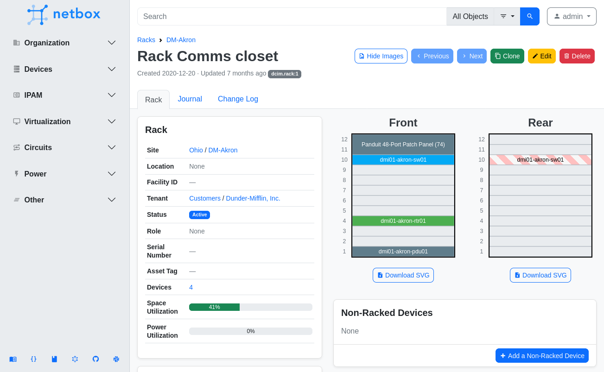

# NetBox v3.0

## v3.0.12 (2021-12-06)

### Enhancements

* [#7751](https://github.com/netbox-community/netbox/issues/7751) - Get API user from LDAP only when `FIND_GROUP_PERMS` is enabled
* [#7885](https://github.com/netbox-community/netbox/issues/7885) - Linkify VLAN name in VLANs table
* [#7892](https://github.com/netbox-community/netbox/issues/7892) - Add L22-30 power port & outlet types
* [#7932](https://github.com/netbox-community/netbox/issues/7932) - Improve performance of the "quick find" function
* [#7941](https://github.com/netbox-community/netbox/issues/7941) - Add multi-standard ITA power outlet type

### Bug Fixes

* [#7823](https://github.com/netbox-community/netbox/issues/7823) - Fix issue where `return_url` is not honored when 'Save & Continue' button is present
* [#7981](https://github.com/netbox-community/netbox/issues/7981) - Fix Markdown sanitization regex

---

## v3.0.11 (2021-11-24)

### Enhancements

* [#2101](https://github.com/netbox-community/netbox/issues/2101) - Add missing `q` filters for necessary models
* [#7424](https://github.com/netbox-community/netbox/issues/7424) - Add virtual chassis filters for device components
* [#7531](https://github.com/netbox-community/netbox/issues/7531) - Add Markdown support for strikethrough formatting
* [#7542](https://github.com/netbox-community/netbox/issues/7542) - Add optional VLAN group column to prefixes table
* [#7803](https://github.com/netbox-community/netbox/issues/7803) - Improve live reloading of custom scripts
* [#7810](https://github.com/netbox-community/netbox/issues/7810) - Add IEEE 802.15.1 interface type

### Bug Fixes

* [#7399](https://github.com/netbox-community/netbox/issues/7399) - Fix excessive CPU utilization when `AUTH_LDAP_FIND_GROUP_PERMS` is enabled
* [#7657](https://github.com/netbox-community/netbox/issues/7657) - Make change logging middleware thread-safe
* [#7720](https://github.com/netbox-community/netbox/issues/7720) - Fix initialization of custom script MultiObjectVar field with multiple values
* [#7729](https://github.com/netbox-community/netbox/issues/7729) - Fix permissions evaluation when displaying VLAN group VLANs table
* [#7739](https://github.com/netbox-community/netbox/issues/7739) - Fix exception when tracing cable across circuit with no far end termination
* [#7813](https://github.com/netbox-community/netbox/issues/7813) - Fix handling of errors during export template rendering
* [#7851](https://github.com/netbox-community/netbox/issues/7851) - Add missing cluster name filter for virtual machines
* [#7857](https://github.com/netbox-community/netbox/issues/7857) - Fix ordering IP addresses by assignment status
* [#7859](https://github.com/netbox-community/netbox/issues/7859) - Fix styling of form widgets under cable connection views
* [#7864](https://github.com/netbox-community/netbox/issues/7864) - `power_port` can be null when creating power outlets via REST API
* [#7865](https://github.com/netbox-community/netbox/issues/7865) - REST API should support null values for console port speeds

---

## v3.0.10 (2021-11-12)

### Enhancements

* [#7740](https://github.com/netbox-community/netbox/issues/7740) - Add mini-DIN 8 console port type
* [#7760](https://github.com/netbox-community/netbox/issues/7760) - Add `vid` filter field to VLANs list
* [#7767](https://github.com/netbox-community/netbox/issues/7767) - Add visual aids to interfaces table for type, enabled status

### Bug Fixes

* [#7564](https://github.com/netbox-community/netbox/issues/7564) - Fix assignment of members to virtual chassis with initial position of zero
* [#7701](https://github.com/netbox-community/netbox/issues/7701) - Fix conflation of assigned IP status & role in interface tables
* [#7741](https://github.com/netbox-community/netbox/issues/7741) - Fix 404 when attaching multiple images in succession
* [#7752](https://github.com/netbox-community/netbox/issues/7752) - Fix minimum version check under Python v3.10
* [#7766](https://github.com/netbox-community/netbox/issues/7766) - Add missing outer dimension columns to rack table
* [#7780](https://github.com/netbox-community/netbox/issues/7780) - Preserve multi-line values during CSV file import
* [#7783](https://github.com/netbox-community/netbox/issues/7783) - Fix indentation of locations under site view
* [#7788](https://github.com/netbox-community/netbox/issues/7788) - Improve XSS mitigation in Markdown renderer
* [#7791](https://github.com/netbox-community/netbox/issues/7791) - Enable sorting device bays table by installed device status
* [#7802](https://github.com/netbox-community/netbox/issues/7802) - Differentiate ID and VID columns in VLANs table
* [#7808](https://github.com/netbox-community/netbox/issues/7808) - Fix reference values for content type under custom field import form
* [#7809](https://github.com/netbox-community/netbox/issues/7809) - Add missing export template support for various models
* [#7814](https://github.com/netbox-community/netbox/issues/7814) - Fix restriction of user & group objects in GraphQL API queries

---

## v3.0.9 (2021-11-03)

### Enhancements

* [#6529](https://github.com/netbox-community/netbox/issues/6529) - Introduce the `runscript` management command
* [#6930](https://github.com/netbox-community/netbox/issues/6930) - Add an optional "ID" column to all tables
* [#7668](https://github.com/netbox-community/netbox/issues/7668) - Add "view elevations" button to location view

### Bug Fixes

* [#7599](https://github.com/netbox-community/netbox/issues/7599) - Improve color mode preference handling
* [#7601](https://github.com/netbox-community/netbox/issues/7601) - Correct devices count for locations within global search results
* [#7612](https://github.com/netbox-community/netbox/issues/7612) - Strip HTML from custom field descriptions
* [#7628](https://github.com/netbox-community/netbox/issues/7628) - Fix `load_yaml` method for custom scripts
* [#7643](https://github.com/netbox-community/netbox/issues/7643) - Fix circuit assignment when creating multiple terminations simultaneously
* [#7644](https://github.com/netbox-community/netbox/issues/7644) - Prevent inadvertent deletion of prior change records when deleting objects (#7333 revisited)
* [#7647](https://github.com/netbox-community/netbox/issues/7647) - Require interface assignment when designating IP address as primary for device/VM during CSV import
* [#7664](https://github.com/netbox-community/netbox/issues/7664) - Preserve initial form data when bulk edit validation fails
* [#7717](https://github.com/netbox-community/netbox/issues/7717) - Restore missing tags column on IP range table
* [#7721](https://github.com/netbox-community/netbox/issues/7721) - Retain pagination preference when `MAX_PAGE_SIZE` is zero

---

## v3.0.8 (2021-10-20)

### Enhancements

* [#7551](https://github.com/netbox-community/netbox/issues/7551) - Add UI field to filter interfaces by kind
* [#7561](https://github.com/netbox-community/netbox/issues/7561) - Add a utilization column to the IP ranges table

### Bug Fixes

* [#7300](https://github.com/netbox-community/netbox/issues/7300) - Fix incorrect Device LLDP interface row coloring
* [#7495](https://github.com/netbox-community/netbox/issues/7495) - Fix navigation UI issue that caused improper element overlap
* [#7529](https://github.com/netbox-community/netbox/issues/7529) - Restore horizontal scrolling for tables in narrow viewports
* [#7534](https://github.com/netbox-community/netbox/issues/7534) - Avoid exception when utilizing "create and add another" twice in succession
* [#7544](https://github.com/netbox-community/netbox/issues/7544) - Fix multi-value filtering of custom field objects
* [#7545](https://github.com/netbox-community/netbox/issues/7545) - Fix incorrect display of update/delete events for webhooks
* [#7550](https://github.com/netbox-community/netbox/issues/7550) - Fix rendering of UTF8-encoded data in change records
* [#7556](https://github.com/netbox-community/netbox/issues/7556) - Fix display of version when new release is available
* [#7584](https://github.com/netbox-community/netbox/issues/7584) - Fix alignment of object identifier under object view

---

## v3.0.7 (2021-10-08)

### Enhancements

* [#6879](https://github.com/netbox-community/netbox/issues/6879) - Improve ability to toggle images/labels in rack elevations 
* [#7485](https://github.com/netbox-community/netbox/issues/7485) - Add USB micro AB type

### Bug Fixes

* [#7051](https://github.com/netbox-community/netbox/issues/7051) - Fix permissions evaluation and improve error handling for connected device REST API endpoint
* [#7471](https://github.com/netbox-community/netbox/issues/7471) - Correct redirect URL when attaching images via "add another" button
* [#7474](https://github.com/netbox-community/netbox/issues/7474) - Fix AttributeError exception when rendering a report or custom script
* [#7479](https://github.com/netbox-community/netbox/issues/7479) - Fix parent interface choices when bulk editing VM interfaces

---

## v3.0.6 (2021-10-06)

### Enhancements

* [#6850](https://github.com/netbox-community/netbox/issues/6850) - Default to current user when creating journal entries via REST API
* [#6955](https://github.com/netbox-community/netbox/issues/6955) - Include type, ID, and slug on object view
* [#7394](https://github.com/netbox-community/netbox/issues/7394) - Enable filtering cables by termination type & ID in REST API
* [#7462](https://github.com/netbox-community/netbox/issues/7462) - Include count of assigned virtual machines under platform view

### Bug Fixes

* [#7442](https://github.com/netbox-community/netbox/issues/7442) - Fix missing actions column on user-configured tables
* [#7446](https://github.com/netbox-community/netbox/issues/7446) - Fix exception when viewing a large number of child IPs within a prefix
* [#7455](https://github.com/netbox-community/netbox/issues/7455) - Fix site/provider network validation for circuit termination API serializer
* [#7459](https://github.com/netbox-community/netbox/issues/7459) - Pre-populate location data when adding a device to a rack
* [#7460](https://github.com/netbox-community/netbox/issues/7460) - Fix filtering connections by site ID

---

## v3.0.5 (2021-10-04)

### Enhancements

* [#5925](https://github.com/netbox-community/netbox/issues/5925) - Always show IP addresses tab under prefix view
* [#6423](https://github.com/netbox-community/netbox/issues/6423) - Cache rendered REST API specifications
* [#6708](https://github.com/netbox-community/netbox/issues/6708) - Add image attachment support for circuits, power panels
* [#7387](https://github.com/netbox-community/netbox/issues/7387) - Enable arbitrary ordering of custom scripts

### Bug Fixes

* [#6433](https://github.com/netbox-community/netbox/issues/6433) - Fix bulk editing of child prefixes under aggregate view
* [#6817](https://github.com/netbox-community/netbox/issues/6817) - Custom field columns should be removed from tables upon their deletion
* [#6895](https://github.com/netbox-community/netbox/issues/6895) - Remove errant markup for null values in CSV export
* [#7215](https://github.com/netbox-community/netbox/issues/7215) - Prevent rack elevations from overlapping when higher width is specified
* [#7373](https://github.com/netbox-community/netbox/issues/7373) - Fix flashing when server, client, and browser color-mode preferences are mismatched
* [#7397](https://github.com/netbox-community/netbox/issues/7397) - Fix AttributeError exception when rendering export template for devices via REST API
* [#7401](https://github.com/netbox-community/netbox/issues/7401) - Pin `jsonschema` package to v3.2.0 to fix REST API docs rendering
* [#7411](https://github.com/netbox-community/netbox/issues/7411) - Fix exception in UI when adding member devices to virtual chassis
* [#7412](https://github.com/netbox-community/netbox/issues/7412) - Fix exception in UI when adding child device to device bay
* [#7417](https://github.com/netbox-community/netbox/issues/7417) - Prevent exception when filtering objects list by invalid tag
* [#7425](https://github.com/netbox-community/netbox/issues/7425) - Housekeeping command should honor zero verbosity
* [#7427](https://github.com/netbox-community/netbox/issues/7427) - Don't select hidden rows when selecting all in a table

---

## v3.0.4 (2021-09-29)

### Enhancements

* [#6917](https://github.com/netbox-community/netbox/issues/6917) - Make IP assigned checkmark in IP table link to interface
* [#6973](https://github.com/netbox-community/netbox/issues/6973) - Enable custom ordering of reports
* [#7022](https://github.com/netbox-community/netbox/issues/7022) - Add ITA type C (CEE 7/16) power port type
* [#7118](https://github.com/netbox-community/netbox/issues/7118) - Render URL custom fields as hyperlinks in object tables
* [#7314](https://github.com/netbox-community/netbox/issues/7314) - Add SMA 905/906 fiber port types
* [#7323](https://github.com/netbox-community/netbox/issues/7323) - Add serial filter field for racks & devices
* [#7372](https://github.com/netbox-community/netbox/issues/7372) - Link to local docs for model from object add/edit views
* [#7389](https://github.com/netbox-community/netbox/issues/7389) - Linkify tenant group in tenants list

### Bug Fixes

* [#7252](https://github.com/netbox-community/netbox/issues/7252) - Validate IP range size does not exceed max supported value
* [#7294](https://github.com/netbox-community/netbox/issues/7294) - Fix SVG rendering for cable traces ending at unoccupied front ports
* [#7304](https://github.com/netbox-community/netbox/issues/7304) - Require explicit values for all required choice fields during CSV import
* [#7321](https://github.com/netbox-community/netbox/issues/7321) - Don't overwrite multi-select custom fields during bulk edit
* [#7324](https://github.com/netbox-community/netbox/issues/7324) - Fix TypeError exception in web UI when filtering objects using single-choice filters
* [#7333](https://github.com/netbox-community/netbox/issues/7333) - Prevent inadvertent deletion of prior change records when deleting objects
* [#7341](https://github.com/netbox-community/netbox/issues/7341) - Fix incorrect URL in circuit breadcrumbs
* [#7353](https://github.com/netbox-community/netbox/issues/7353) - Fix bulk creation of device/VM components via list view
* [#7356](https://github.com/netbox-community/netbox/issues/7356) - Fix display of model documentation when adding device components
* [#7358](https://github.com/netbox-community/netbox/issues/7358) - Add missing `choices` column to custom field CSV import form
* [#7360](https://github.com/netbox-community/netbox/issues/7360) - Correct redirection URL after removing child device from device bay
* [#7365](https://github.com/netbox-community/netbox/issues/7365) - Optimize performance when calculating prefix utilization
* [#7374](https://github.com/netbox-community/netbox/issues/7374) - Add missing `face` parameter to API elevations request when editing device
* [#7392](https://github.com/netbox-community/netbox/issues/7392) - Fix "help" links for custom fields, other models

---

## v3.0.3 (2021-09-20)

### Enhancements

* [#5775](https://github.com/netbox-community/netbox/issues/5775) - Enable synchronization of groups for remote authentication backend
* [#6387](https://github.com/netbox-community/netbox/issues/6387) - Add xDSL interface type
* [#6988](https://github.com/netbox-community/netbox/issues/6988) - Order tenants alphabetically without regard to group assignment
* [#7032](https://github.com/netbox-community/netbox/issues/7032) - Add URM port types
* [#7087](https://github.com/netbox-community/netbox/issues/7087) - Add `local_context_data` filter for virtual machines list
* [#7208](https://github.com/netbox-community/netbox/issues/7208) - Add navigation breadcrumbs for custom scripts & reports
* [#7210](https://github.com/netbox-community/netbox/issues/7210) - Add search/filter forms for all organizational models
* [#7239](https://github.com/netbox-community/netbox/issues/7239) - Redirect global search to filtered object list when an object type is selected
* [#7284](https://github.com/netbox-community/netbox/issues/7284) - Include comments field in table/export for all appropriate models

### Bug Fixes

* [#7167](https://github.com/netbox-community/netbox/issues/7167) - Ensure consistent font size when using monospace formatting
* [#7226](https://github.com/netbox-community/netbox/issues/7226) - Exempt GraphQL API requests from CSRF inspection
* [#7228](https://github.com/netbox-community/netbox/issues/7228) - Improve temperature conversions under device status
* [#7248](https://github.com/netbox-community/netbox/issues/7248) - Fix global search results section links
* [#7266](https://github.com/netbox-community/netbox/issues/7266) - Tweak font color for form field placeholder text
* [#7273](https://github.com/netbox-community/netbox/issues/7273) - Fix natural ordering of device components in UI form fields
* [#7279](https://github.com/netbox-community/netbox/issues/7279) - Fix exception when tracing cable with no associated path
* [#7282](https://github.com/netbox-community/netbox/issues/7282) - Fix KeyError exception when `INSECURE_SKIP_TLS_VERIFY` is true
* [#7298](https://github.com/netbox-community/netbox/issues/7298) - Restore missing object names from applied object list filters
* [#7301](https://github.com/netbox-community/netbox/issues/7301) - Fix exception when deleting a large number of child prefixes

---

## v3.0.2 (2021-09-08)

### Bug Fixes

* [#7131](https://github.com/netbox-community/netbox/issues/7131) - Fix issue where Site fields were hidden when editing a VLAN group
* [#7148](https://github.com/netbox-community/netbox/issues/7148) - Fix issue where static query parameters with multiple values were not queried properly
* [#7153](https://github.com/netbox-community/netbox/issues/7153) - Allow clearing of assigned device type images
* [#7162](https://github.com/netbox-community/netbox/issues/7162) - Ensure consistent treatment of `BASE_PATH` for UI-driven API requests
* [#7164](https://github.com/netbox-community/netbox/issues/7164) - Fix styling of "decommissioned" label for circuits
* [#7169](https://github.com/netbox-community/netbox/issues/7169) - Fix CSV import file upload
* [#7176](https://github.com/netbox-community/netbox/issues/7176) - Fix issue where query parameters were duplicated across different forms of the same type
* [#7179](https://github.com/netbox-community/netbox/issues/7179) - Prevent obscuring "connect" pop-up for interfaces under device view
* [#7188](https://github.com/netbox-community/netbox/issues/7188) - Fix issue where select fields with `null_option` did not render or send the null option
* [#7189](https://github.com/netbox-community/netbox/issues/7189) - Set connection factory for django-redis when Sentinel is in use
* [#7191](https://github.com/netbox-community/netbox/issues/7191) - Fix issue where API-backed multi-select elements cleared selected options when adding new options
* [#7193](https://github.com/netbox-community/netbox/issues/7193) - Fix prefix (flat) template issue when viewing child prefixes with prefixes available
* [#7205](https://github.com/netbox-community/netbox/issues/7205) - Fix issue where selected fields with `null_option` set were not added to applied filters
* [#7209](https://github.com/netbox-community/netbox/issues/7209) - Allow unlimited API results when `MAX_PAGE_SIZE` is disabled

---

## v3.0.1 (2021-09-01)

### Bug Fixes

* [#7041](https://github.com/netbox-community/netbox/issues/7041) - Properly format JSON config object returned from a NAPALM device
* [#7070](https://github.com/netbox-community/netbox/issues/7070) - Fix exception when filtering by prefix max length in UI
* [#7071](https://github.com/netbox-community/netbox/issues/7071) - Fix exception when removing a primary IP from a device/VM
* [#7072](https://github.com/netbox-community/netbox/issues/7072) - Fix table configuration under prefix child object views
* [#7075](https://github.com/netbox-community/netbox/issues/7075) - Fix UI bug when a custom field has a space in the name
* [#7080](https://github.com/netbox-community/netbox/issues/7080) - Fix missing image previews
* [#7081](https://github.com/netbox-community/netbox/issues/7081) - Fix UI bug that did not properly request and handle paginated data
* [#7082](https://github.com/netbox-community/netbox/issues/7082) - Avoid exception when referencing invalid content type in table
* [#7083](https://github.com/netbox-community/netbox/issues/7083) - Correct labeling for VM memory attribute
* [#7084](https://github.com/netbox-community/netbox/issues/7084) - Fix KeyError exception when editing access VLAN on an interface
* [#7084](https://github.com/netbox-community/netbox/issues/7084) - Fix issue where hidden VLAN form fields were incorrectly included in the form submission
* [#7089](https://github.com/netbox-community/netbox/issues/7089) - Fix filtering of change log by content type
* [#7090](https://github.com/netbox-community/netbox/issues/7090) - Allow decimal input on length field when bulk editing cables
* [#7091](https://github.com/netbox-community/netbox/issues/7091) - Ensure API requests from the UI are aware of `BASE_PATH`
* [#7092](https://github.com/netbox-community/netbox/issues/7092) - Fix missing bulk edit buttons on Prefix IP Addresses table
* [#7093](https://github.com/netbox-community/netbox/issues/7093) - Multi-select custom field filters should employ exact match
* [#7096](https://github.com/netbox-community/netbox/issues/7096) - Home links should honor `BASE_PATH` configuration
* [#7101](https://github.com/netbox-community/netbox/issues/7101) - Enforce `MAX_PAGE_SIZE` for table and REST API pagination
* [#7106](https://github.com/netbox-community/netbox/issues/7106) - Fix incorrect "Map It" button URL on a site's physical address field
* [#7107](https://github.com/netbox-community/netbox/issues/7107) - Fix missing search button and search results in IP address assignment "Assign IP" tab
* [#7109](https://github.com/netbox-community/netbox/issues/7109) - Ensure human readability of exceptions raised during REST API requests
* [#7113](https://github.com/netbox-community/netbox/issues/7113) - Show bulk edit/delete actions for prefix child objects
* [#7123](https://github.com/netbox-community/netbox/issues/7123) - Remove "Global" placeholder for null VRF field
* [#7124](https://github.com/netbox-community/netbox/issues/7124) - Fix duplicate static query param values in API Select

---

## v3.0.0 (2021-08-30)

!!! warning "Existing Deployments Must Upgrade from v2.11"
    Upgrading an existing NetBox deployment to version 3.0 **must** be done from version 2.11.0 or later. If attempting to upgrade a deployment of NetBox v2.10 or earlier, first upgrade to a NetBox v2.11 release, and then upgrade from v2.11 to v3.0. This will avoid any problems with the database migration optimizations implemented in version 3.0. (This is not necessary for _new_ installations.)

### Breaking Changes

* Python 3.6 is no longer supported. NetBox v3.0 supports Python 3.7, 3.8, and 3.9.
* The secrets functionality present in prior releases of NetBox has been removed. The NetBox maintainers strongly recommend the adoption of [Hashicorp Vault](https://github.com/hashicorp/vault) in place of this feature. Development of a NetBox plugin to replace the legacy secrets functionality is also underway.
* The default CSV export format for all objects now includes all available data from the object list. Additionally, the CSV headers now use human-friendly titles rather than raw field names. If backward compatibility with the old format is desired, export templates can be written to reproduce it.
* The `invalidate` management command (which clears cached database queries) is no longer needed and has been removed (see [#6639](https://github.com/netbox-community/netbox/issues/6639)).
* Support for queryset caching configuration (`caching_config`) has been removed from the plugins API (see [#6639](https://github.com/netbox-community/netbox/issues/6639)).
* The `cacheops_*` metrics have been removed from the Prometheus exporter (see [#6639](https://github.com/netbox-community/netbox/issues/6639)).
* The `display_field` keyword argument has been removed from custom script ObjectVar and MultiObjectVar fields. These widgets will use the `display` value provided by the REST API.
* The deprecated `display_name` field has been removed from all REST API serializers. (API clients should reference the `display` field instead.)
* The redundant REST API endpoints for console, power, and interface connections have been removed. The same data can be retrieved by querying the respective model endpoints with the `?connected=True` filter applied.

### New Features

#### Updated User Interface ([#5893](https://github.com/netbox-community/netbox/issues/5893))

The NetBox user interface has been completely overhauled with a fresh new look! Beyond the cosmetic improvements, this initiative has allowed us to modernize the entire front end, upgrading from Bootstrap 3 to Bootstrap 5, and eliminating dependencies on outdated libraries such as jQuery and jQuery-UI. The new user interface also features a dark mode option.



A huge thank you to NetBox maintainer [Matt Love](https://github.com/thatmattlove) for his tremendous work on this!

#### GraphQL API ([#2007](https://github.com/netbox-community/netbox/issues/2007))

A new [GraphQL API](https://graphql.org/) has been added to complement NetBox's REST API. GraphQL allows the client to specify which fields of the available data to return in each request. NetBox's implementation, which employs [Graphene](https://graphene-python.org/), also includes a user-friendly query interface known as GraphiQL.

Here's an example GraphQL request:

```
{
  circuit_list {
    cid
    provider {
      name
    }
    termination_a {
      id
    }
    termination_z {
      id
    }
  }
}
```

And the response:

```
{
  "data": {
    "circuit_list": [
      {
        "cid": "1002840283",
        "provider": {
          "name": "CenturyLink"
        },
        "termination_a": null,
        "termination_z": {
          "id": "23"
        }
      },
...
```

All GraphQL requests are made at the `/graphql` URL (which also serves the GraphiQL UI). The API is currently read-only, however users who wish to disable it until needed can do so by setting the `GRAPHQL_ENABLED` configuration parameter to False. For more detail on NetBox's GraphQL implementation, see [the GraphQL API documentation](../integrations/graphql-api.md).

#### IP Ranges ([#834](https://github.com/netbox-community/netbox/issues/834))

NetBox now supports modeling arbitrary IP ranges, which are defined by specifying a starting and ending IP address (e.g. to denote DHCP pools). Similar to prefixes, each IP range may optionally be assigned to a VRF and/or tenant, and can be assigned a functional role. An IP range must be assigned a status of active, reserved, or deprecated. The REST API implementation for this model also includes an "available IPs" endpoint which functions similarly to the endpoint for prefixes.

More information about IP ranges is available [in the documentation](../models/ipam/iprange.md).

#### Custom Model Validation ([#5963](https://github.com/netbox-community/netbox/issues/5963))

This release introduces the [`CUSTOM_VALIDATORS`](../configuration/data-validation.md#custom_validators) configuration parameter, which allows administrators to map NetBox models to custom validator classes to enforce custom validation logic. For example, the following configuration requires every site to have a name of at least ten characters and a description:

```python
from extras.validators import CustomValidator

CUSTOM_VALIDATORS = {
    'dcim.site': (
        CustomValidator({
            'name': {
                'min_length': 10,
            },
            'description': {
                'required': True,
            }
        }),
    )
}
```

CustomValidator can also be subclassed to enforce more complex logic by overriding its `validate()` method. See the [custom validation](../customization/custom-validation.md) documentation for more details.

#### SVG Cable Traces ([#6000](https://github.com/netbox-community/netbox/issues/6000))

Cable trace diagrams are now rendered as atomic SVG images, similar to rack elevations. These images are embedded in the UI and can be easily downloaded for use outside NetBox. SVG images can also be generated directly through the REST API, by specifying SVG as the render format for the `trace` endpoint on a cable termination:

```no-highlight
GET /api/dcim/interfaces/<ID>>/trace/?render=svg
```

The width of the rendered image in pixels may optionally be specified by appending the `&width=<width>` parameter to the request. The default width is 400px.

#### New Views for Models Previously Under the Admin UI ([#6466](https://github.com/netbox-community/netbox/issues/6466))

New UI views have been introduced to manage the following models:

* Custom fields
* Custom links
* Export templates
* Webhooks

These models were previously managed under the admin section of the UI. Moving them to dedicated views ensures a more consistent and convenient user experience.

#### REST API Token Provisioning ([#5264](https://github.com/netbox-community/netbox/issues/5264))

The new REST API endpoint `/api/users/tokens/` has been added, which includes a child endpoint for provisioning new REST API tokens using a username and password. This allows a user to gain REST API access without needing to first create a token via the web UI.

```
$ curl -X POST \
-H "Content-Type: application/json" \
-H "Accept: application/json; indent=4" \
https://netbox/api/users/tokens/provision/ \
--data '{
    "username": "hankhill",
    "password: "I<3C3H8",
}'
```

If the supplied credentials are valid, NetBox will create and return a new token for the user.

#### New Housekeeping Command ([#6590](https://github.com/netbox-community/netbox/issues/6590))

A new management command has been added: `manage.py housekeeping`. This command is intended to be run nightly via a system cron job. It performs the following tasks:

* Clear expired authentication sessions from the database
* Delete change log records which have surpassed the configured retention period (if configured)
* Check for new NetBox releases (if enabled)

A convenience script for calling this command via an automated scheduler has been included at `/contrib/netbox-housekeeping.sh`. Please see the [housekeeping documentation](../administration/housekeeping.md) for further details.

#### Custom Queue Support for Plugins ([#6651](https://github.com/netbox-community/netbox/issues/6651))

NetBox uses Redis and Django-RQ for background task queuing. Whereas previous releases employed only a single default queue, NetBox now provides a high-, medium- (default), and low-priority queue for use by plugins. (These will also likely be used internally as new functionality is added in future releases.)

Plugins can also now create their own custom queues by defining a `queues` list within their PluginConfig class:

```python
class MyPluginConfig(PluginConfig):
    name = 'myplugin'
    ...
    queues = [
        'queue1',
        'queue2',
        'queue-whatever-the-name'
    ]
```

Note that NetBox's `rqworker` process will _not_ service custom queues by default, since it has no way to infer the priority of each queue. Plugin authors should be diligent in including instructions for proper worker configuration in their plugin's documentation.

### Enhancements

* [#2434](https://github.com/netbox-community/netbox/issues/2434) - Add option to assign IP address upon creating a new interface
* [#3665](https://github.com/netbox-community/netbox/issues/3665) - Enable rendering export templates via REST API
* [#3682](https://github.com/netbox-community/netbox/issues/3682) - Add `color` field to front and rear ports
* [#4609](https://github.com/netbox-community/netbox/issues/4609) - Allow marking prefixes as fully utilized
* [#5203](https://github.com/netbox-community/netbox/issues/5203) - Remember user preference when toggling display of device images in rack elevations
* [#5806](https://github.com/netbox-community/netbox/issues/5806) - Add kilometer and mile as choices for cable length unit
* [#6154](https://github.com/netbox-community/netbox/issues/6154) - Allow decimal values for cable lengths
* [#6328](https://github.com/netbox-community/netbox/issues/6328) - Build and serve documentation locally

### Bug Fixes (from v3.0-beta2)

* [#6977](https://github.com/netbox-community/netbox/issues/6977) - Truncate global search dropdown on small screens
* [#6979](https://github.com/netbox-community/netbox/issues/6979) - Hide "create & add another" button for circuit terminations
* [#6982](https://github.com/netbox-community/netbox/issues/6982) - Fix styling of empty dropdown list under dark mode
* [#6996](https://github.com/netbox-community/netbox/issues/6996) - Global search bar should be full width on mobile
* [#7001](https://github.com/netbox-community/netbox/issues/7001) - Fix page focus on load
* [#7034](https://github.com/netbox-community/netbox/issues/7034) - Fix toggling of VLAN group scope selector fields
* [#7045](https://github.com/netbox-community/netbox/issues/7045) - Fix navigation menu rendering under Chrome

### Other Changes

* [#5223](https://github.com/netbox-community/netbox/issues/5223) - Remove the console/power/interface connections REST API endpoints
* [#5278](https://github.com/netbox-community/netbox/issues/5278) - Remove the secrets functionality from NetBox core
* [#5532](https://github.com/netbox-community/netbox/issues/5532) - Drop support for Python 3.6
* [#5994](https://github.com/netbox-community/netbox/issues/5994) - Drop support for `display_field` argument on ObjectVar
* [#6068](https://github.com/netbox-community/netbox/issues/6068) - Drop support for legacy static CSV export
* [#6338](https://github.com/netbox-community/netbox/issues/6338) - Decimal fields are no longer coerced to strings in REST API
* [#6471](https://github.com/netbox-community/netbox/issues/6471) - Optimize database migrations
* [#6639](https://github.com/netbox-community/netbox/issues/6639) - Drop support for queryset caching (django-cacheops)
* [#6713](https://github.com/netbox-community/netbox/issues/6713) - Checking for new releases is now done as part of the housekeeping routine
* [#6767](https://github.com/netbox-community/netbox/issues/6767) - Add support for Python 3.9

### Configuration Changes

* The `CACHE_TIMEOUT` configuration parameter has been removed.
* The `RELEASE_CHECK_TIMEOUT` configuration parameter has been removed.

### REST API Changes

* Removed all endpoints related to the secrets functionality:
    * `/api/secrets/generate-rsa-key-pair/`
    * `/api/secrets/get-session-key/`
    * `/api/secrets/secrets/`
    * `/api/secrets/secret-roles/`
* Removed the following "connections" endpoints:
    * `/api/dcim/console-connections/`
    * `/api/dcim/power-connections/`
    * `/api/dcim/interface-connections/`
* Added the `/api/ipam/ip-ranges/` endpoint
* Added the `/api/users/tokens/` endpoint
    * The `provision/` child endpoint can be used to provision new REST API tokens by supplying a valid username and password
* dcim.Cable
    * `length` is now a decimal value
* dcim.Device
    * Removed the `display_name` attribute (use `display` instead)
* dcim.DeviceType
    * Removed the `display_name` attribute (use `display` instead)
* dcim.FrontPort
    * Added `color` field
* dcim.FrontPortTemplate
    * Added `color` field
* dcim.Rack
    * Removed the `display_name` attribute (use `display` instead)
* dcim.RearPort
    * Added `color` field
* dcim.RearPortTemplate
    * Added `color` field
* dcim.Site
    * `latitude` and `longitude` are now decimal fields rather than strings
* extras.ContentType
    * Removed the `display_name` attribute (use `display` instead)
* ipam.Prefix
    * Added the `mark_utilized` boolean field
* ipam.VLAN
    * Removed the `display_name` attribute (use `display` instead)
* ipam.VRF
    * Removed the `display_name` attribute (use `display` instead)
* virtualization.VirtualMachine
    * `vcpus` is now a decimal field rather than a string
